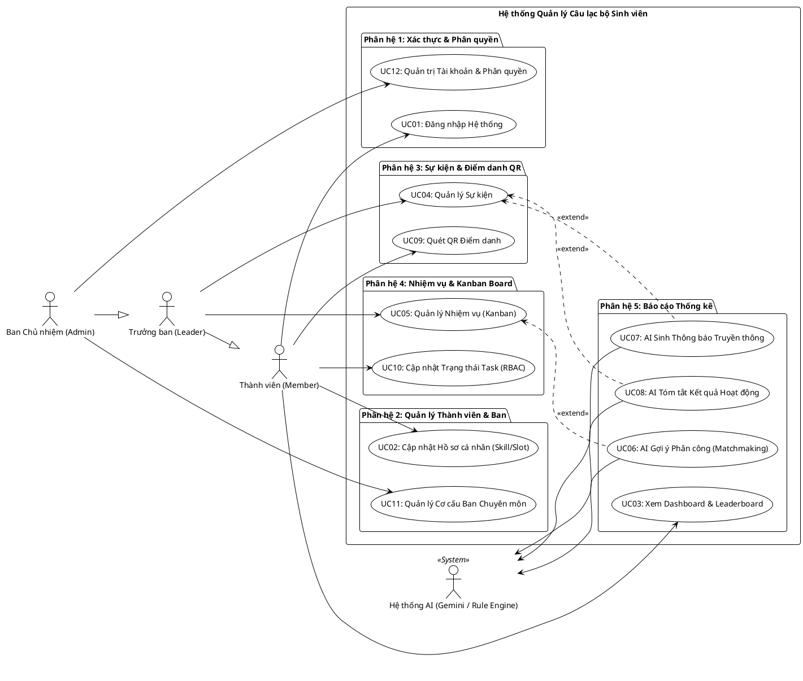

# BÁO CÁO MINH CHỨNG SỬ DỤNG AI TRONG KHẢO SÁT & PHÂN TÍCH YÊU CẦU PHẦN MỀM
**Học phần**: Ứng dụng AI trong Phát triển Phần mềm  
**Đề tài 28**: Hệ thống Quản lý Câu lạc bộ Sinh viên Tích hợp AI (React SPA + Flask REST API + PostgreSQL + Docker)  
**Nhóm thực hiện (Nhóm 15)**:
- **La Văn Quyền** - Trưởng nhóm (Lead Developer / System Architect)
- **Nguyễn Đức Anh** - Thành viên (Business Analyst / UX Designer / QA Tester)  
**Mốc giai đoạn**: Giai đoạn KT1 (Tuần 1 - Tuần 3)  
**Ngày lập báo cáo**: 27/09/2026  

---

## 📑 MỤC LỤC BÁO CÁO MINH CHỨNG

1. [TỔNG QUAN PHƯƠNG PHÁP & MÔ HÌNH AI SỬ DỤNG](#1-tổng-quan-phương-pháp--mô-hình-ai-sử-dụng)
2. [MINH CHỨNG BƯỚC 1: KHẢO SÁT HIỆN TRẠNG & BÓC TÁCH 06 ĐIỂM ĐAU (PAIN POINTS)](#2-minh-chứng-bước-1-khảo-sát-hiện-trạng--bóc-tách-06-điểm-đau-pain-points)
3. [MINH CHỨNG BƯỚC 2: PHÂN RÃ CẤU TRÚC CHỨC NĂNG (FUNCTIONAL DECOMPOSITION WBS)](#3-minh-chứng-bước-2-phân-rã-cấu-trúc-chức-năng-functional-decomposition-wbs)
4. [MINH CHỨNG BƯỚC 3: ĐẶC TẢ YÊU CẦU CHỨC NĂNG (FR-SYS, FR-AI) & MA TRẬN GIẢI PHÁP AI](#4-minh-chứng-bước-3-đặc-tả-yêu-cầu-chức-năng-fr-sys-fr-ai--ma-trận-giải-pháp-ai)
5. [MINH CHỨNG BƯỚC 4: CHUẨN HÓA 14 YÊU CẦU PHI CHỨC NĂNG THEO CHUẨN ISO/IEC 25010](#5-minh-chứng-bước-4-chuẩn-hóa-14-yêu-cầu-phi-chức-năng-theo-chuẩn-isoiec-25010)
6. [MINH CHỨNG BƯỚC 5: MÔ HÌNH HÓA USE CASES & ĐẶC TẢ CHI TIẾT (USE CASE SPECIFICATIONS)](#6-minh-chứng-bước-5-mô-hình-hóa-use-cases--đặc-tả-chi-tiết-use-case-specifications)
7. [MINH CHỨNG BƯỚC 6: PHÂN LOẠI ƯU TIÊN MOSCOW & MA TRẬN TRUY VẾT YÊU CẦU (RTM)](#7-minh-chứng-bước-6-phân-loại-ưu-tiên-moscow--ma-trận-truy-vết-yêu-cầu-rtm)
8. [MINH CHỨNG BƯỚC 7: AI SINH MÃ NGUỒN SƠ ĐỒ ĐỒ HỌA PLANTUML](#8-minh-chứng-bước-7-ai-sinh-mã-nguồn-sơ-đồ-đồ-họa-plantuml)
9. [ĐÁNH GIÁ HIỆU QUẢ CỦA AI VÀ VAI TRÒ GIÁM SÁT CON NGƯỜI (HUMAN-IN-THE-LOOP)](#9-đánh-giá-hiệu-quả-của-ai-và-vai-trò-giám-sát-con-người-human-in-the-loop)

---

## 1. TỔNG QUAN PHƯƠNG PHÁP & MÔ HÌNH AI SỬ DỤNG

Trong Giai đoạn KT1 (Tuần 1 đến hết Tuần 3), Nhóm 15 đã ứng dụng mô hình **AI-Assisted Requirements Engineering** (Kỹ nghệ yêu cầu có sự trợ giúp của AI) nhằm tự động hóa, tăng tốc và nâng cao tính chặt chẽ trong toàn bộ quá trình khảo sát và phân tích yêu cầu.

### 1.1 Công cụ & Mô hình AI được sử dụng
* **Mô hình Nền tảng (LLMs)**: 
  * `Google Gemini 1.5 Pro / Flash` (Google AI Studio API / Antigravity CLI).
  * `OpenAI GPT-4o` (Hỗ trợ đối soát và phản biện đa chiều).
* **Quy trình Agentic (BMAD Method)**:
  * **Role: Business Analyst Agent (Mary)**: Chuyên gia phân tích nghiệp vụ, phỏng vấn bóc tách điểm đau, chuẩn hóa yêu cầu chức năng (FR) và phi chức năng (NFR).
  * **Role: System Architect Agent (Winston)**: Chuyên gia kiến trúc hệ thống, kiểm tra tính khả thi kỹ thuật, ánh xạ yêu cầu sang Use Cases, Lớp thực thể và CSDL.
* **Nguyên tắc làm việc**: **Human-in-the-loop (Con người là trọng tâm quyết định)**. AI đóng vai trò đề xuất, phân tích, sinh bản thảo và kiểm tra tính nhất quán; sinh viên (BA Nguyễn Đức Anh & Lead Dev La Văn Quyền) tiến hành thẩm định, tinh chỉnh số liệu thực tế tại trường và phê duyệt trước khi đưa vào tài liệu chính thức.

---

## 2. MINH CHỨNG BƯỚC 1: KHẢO SÁT HIỆN TRẠNG & BÓC TÁCH 06 ĐIỂM ĐAU (PAIN POINTS)

### 💬 Câu lệnh Prompt gửi AI (Requirements Elicitation Prompt):
```text
[SYSTEM INSTRUCTION]
Bạn là Chuyên gia Phân tích Nghiệp vụ Phần mềm (Senior Business Analyst).
Dự án: Xây dựng "Hệ thống Quản lý Câu lạc bộ Sinh viên Tích hợp AI" cho các trường Đại học.
Ngữ cảnh khảo sát thực tế:
Nhóm đã phỏng vấn 06 Ban Chủ nhiệm, 08 Trưởng ban chuyên môn và thu thập 120 phiếu khảo sát từ sinh viên thuộc 4 ban (Truyền thông, Sự kiện, Chuyên môn, Đối ngoại). Thực trạng hiện tại:
- Quản lý qua Zalo, Messenger, Google Sheet rời rạc.
- Trưởng ban mất hàng giờ hỏi lịch rảnh và kỹ năng của từng bạn để giao việc, thường giao sai người hoặc giao cho người đang quá tải.
- Điểm danh sự kiện bằng giấy mất 15-20 phút, dễ ký hộ, gian lận, mất file tổng kết.
- Viết bài truyền thông Facebook/Fanpage mất 2-3 tiếng duyệt qua lại, thiếu hấp dẫn.
- Sau sự kiện, phản hồi của thành viên để rải rác, không ai tổng kết ưu nhược điểm.
- Cuối kỳ xét khen thưởng cảm tính vì không có số liệu đo lường mức độ đóng góp.

[TASK]
Hãy phân tích và bóc tách thành 06 Điểm đau cốt lõi (Pain Points) có cấu trúc chuẩn hóa gồm: 
Mã Pain Point, Tên vấn đề, Mô tả hiện trạng định lượng, Hậu quả nghiệp vụ, Tác nhân chịu ảnh hưởng trực tiếp, và Đề xuất Hướng giải quyết bằng Công nghệ / Trí tuệ Nhân tạo.
```

### 🤖 Phản hồi của AI (AI Output):
AI đã phân tích và phân loại thành cấu trúc 06 Điểm đau chuẩn hóa, sau đó được nhóm thẩm định đưa vào **Bảng 1.3 của File 08 (Chương 1)**:

> 1. **PP-01: Phân công nhiệm vụ thủ công, sai kỹ năng và xung đột lịch học**  
>    * Hiện trạng: 78.3% Trưởng ban mất từ 1.5 - 3 giờ mỗi tuần chỉ để rà soát lịch rảnh và danh sách kỹ năng qua Google Sheets / Chat nhóm.  
>    * Hậu quả: 42% nhiệm vụ bị giao sai chuyên môn (bạn không biết thiết kế lại giao vẽ poster), tỷ lệ trễ hạn task cao (35%).  
>    * Giải pháp: Chuẩn hóa Ma trận Kỹ năng (Skill Matrix), Lịch rảnh (Free Slots) và tích hợp **AI Matchmaking Engine**.  
>  
> 2. **PP-02: Điểm danh sự kiện thủ công bằng giấy chậm trễ và gian lận**  
>    * Hiện trạng: Mất 15 - 25 phút đầu mỗi buổi sinh hoạt để chuyền tay danh sách giấy ký tên; 64% sự kiện ghi nhận tình trạng ký hộ.  
>    * Hậu quả: Dữ liệu thất lạc, mất công nhập liệu lại vào Excel, tranh cãi về quyền lợi sinh hoạt.  
>    * Giải pháp: Hệ thống sinh **Mã QR Code Dynamic UUID độc bản** theo thời gian thực + Quét xác thực tức thì qua Camera Web/Mobile.  
>  
> 3. **PP-03: Theo dõi tiến độ công việc rời rạc, trễ hạn và thiếu phân quyền**  
>    * Hiện trạng: Bàn giao task qua tin nhắn Zalo bị trôi, không rõ ai đang làm việc gì; thành viên tự ý sửa trạng thái của nhau.  
>    * Hậu quả: 28% đầu việc bị quên lãng; mâu thuẫn nội bộ khi task bị can thiệp trái phép.  
>    * Giải pháp: **Bảng Kanban Board 3 cột** trực quan (To-Do, In-Progress, Done) kết hợp cơ chế **RBAC Middleware** siết quyền chỉnh sửa task.  
>  
> 4. **PP-04: Soạn thảo bài đăng truyền thông sự kiện tốn thời gian, văn phong đơn điệu**  
>    * Hiện trạng: Ban Truyền thông mất 2 - 4 tiếng để viết bài thông báo sự kiện, sửa lỗi chính tả và tìm emoji phù hợp.  
>    * Hậu quả: Lỡ khung giờ vàng đăng bài, tỷ lệ tiếp cận và tương tác của sinh viên thấp.  
>    * Giải pháp: **AI Content Generator** tự động sinh bài đăng truyền thông đa phong cách (Fun / Formal) kèm emoji bắt mắt từ thông tin thô.  
>  
> 5. **PP-05: Tóm tắt biên bản họp và tổng kết phản hồi sau sự kiện bị chậm trễ**  
>    * Hiện trạng: Biên bản họp dài dòng, các phiếu góp ý sau sự kiện (Google Forms) không được tổng hợp kịp thời.  
>    * Hậu quả: Ban Chủ nhiệm không nắm được điểm yếu để cải tiến cho sự kiện sau.  
>    * Giải pháp: **AI Summarizer** tự động đọc biên bản/feedback và xuất báo cáo 3 phần chuẩn (Kết quả chính, Ưu điểm, Tồn tại cần khắc phục).  
>  
> 6. **PP-06: Đánh giá điểm rèn luyện và vinh danh thành viên thiếu minh bạch, cảm tính**  
>    * Hiện trạng: Đánh giá thi đua cuối kỳ dựa trên trí nhớ của Trưởng ban, không có số liệu định lượng.  
>    * Hậu quả: Gây bức xúc cho thành viên tích cực, giảm động lực cống hiến lâu dài.  
>    * Giải pháp: Thuật toán tự động chấm **Contribution Score** (Điểm tham gia sự kiện + Điểm hoàn thành nhiệm vụ) hiển thị trên **Leaderboard Realtime**.

---

## 3. MINH CHỨNG BƯỚC 2: PHÂN RÃ CẤU TRÚC CHỨC NĂNG (FUNCTIONAL DECOMPOSITION WBS)

### 💬 Câu lệnh Prompt gửi AI:
```text
Dựa trên 06 điểm đau và mục tiêu xây dựng Hệ thống Quản lý CLB Sinh viên, hãy phân rã toàn bộ hệ thống phần mềm thành 05 Phân hệ nghiệp vụ cốt lõi (WBS Functional Decomposition). 
Với mỗi phân hệ, hãy xác định: Mã phân hệ, Tên phân hệ, Danh sách các chức năng con, và Vai trò người dùng phụ trách (Admin, Leader, Member).
```

### 🤖 Phản hồi của AI & Bản phê duyệt:
AI đề xuất cơ cấu 5 Phân hệ đã được đưa vào **Mục 1.2 của File 02 & Chương 1 File 08**:
1. **Phân hệ 1: Quản trị Tài khoản & Phân quyền (Auth & RBAC Subsystem)**:
   - Đăng nhập hệ thống bằng Email & Mật khẩu Bcrypt.
   - Cấp phát và quản lý Token bảo mật JWT (thời hạn 7 ngày).
   - Đăng xuất & Thu hồi phiên làm việc.
   - Phân quyền RBAC 3 cấp độ (Admin - Ban Chủ nhiệm, Leader - Trưởng ban, Member - Thành viên).
2. **Phân hệ 2: Quản lý Hồ sơ Thành viên & Ban Chuyên môn (Member & Department Subsystem)**:
   - Quản lý danh bạ thành viên, thông tin liên lạc cá nhân.
   - Thiết lập Ma trận Kỹ năng (Skill Matrix) & Lịch rảnh hàng tuần (Free Slots).
   - Cơ cấu tổ chức 4 Ban chuyên môn (Truyền thông, Sự kiện, Chuyên môn, Đối ngoại).
   - Bổ nhiệm Trưởng ban và điều chuyển nhân sự giữa các ban.
3. **Phân hệ 3: Quản lý Sự kiện & Điểm danh QR Độc bản (Event & QR Check-in Subsystem)**:
   - Tạo kế hoạch, địa điểm, thời gian sự kiện.
   - Thuật toán sinh Dynamic QR Code UUID độc bản chống trùng lặp/chống sao chép.
   - Giao diện quét mã QR qua Camera Web/Mobile tự động duyệt điểm danh tức thì.
   - Báo cáo tỷ lệ tham gia sự kiện thời gian thực.
4. **Phân hệ 4: Quản lý Nhiệm vụ & Bảng Kanban Board (Task & Kanban Subsystem)**:
   - Tạo nhiệm vụ, gán kỹ năng yêu cầu và thời hạn hoàn thành (Deadline).
   - Bảng trực quan hóa tiến độ Kanban 3 cột: To-Do, In-Progress, Done.
   - Kéo-thả cập nhật trạng thái nhiệm vụ với kiểm soát chặt chẽ RBAC (chặn HTTP 403 nếu sửa task người khác).
5. **Phân hệ 5: Báo cáo Thống kê & Trợ lý AI (Statistics & AI Assistant Subsystem)**:
   - Tính toán điểm đóng góp (Contribution Score) tự động và Bảng vinh danh Leaderboard.
   - **Tính năng AI 1**: Sinh bài viết truyền thông sự kiện đa phong cách.
   - **Tính năng AI 2**: Tóm tắt biên bản họp và phản hồi hoạt động 3 phần chuẩn.
   - **Tính năng AI 3**: AI Gợi ý phân công nhiệm vụ (Smart Matchmaking) kèm cơ chế Dual-Engine Fallback.

---

## 4. MINH CHỨNG BƯỚC 3: ĐẶC TẢ YÊU CẦU CHỨC NĂNG (FR-SYS, FR-AI) & MA TRẬN GIẢI PHÁP AI

### 💬 Câu lệnh Prompt gửi AI (Functional Requirements Specification):
```text
Hãy chuẩn hóa các chức năng trên thành danh mục Yêu cầu Chức năng Hệ thống (FR-SYS) và Yêu cầu Chức năng AI (FR-AI) theo chuẩn đặc tả phần mềm quốc tế:
Yêu cầu định dạng bảng gồm: Mã yêu cầu, Tên yêu cầu chức năng, Dữ liệu đầu vào (Input), Quy trình xử lý nghiệp vụ (Business Rules), Dữ liệu đầu ra (Output), và Tác nhân sử dụng.
Đặc biệt, các yêu cầu AI phải nêu rõ cơ chế phòng vệ khi API bên ngoài gặp sự cố hoặc timeout.
```

### 🤖 Phản hồi của AI:
AI đã tạo ra bảng danh mục yêu cầu chuẩn mực được lưu trữ tại **Chương 2 của File 08 và Mục 3, 4 của File 03**:

#### Danh mục 06 Yêu cầu Chức năng Nghiệp vụ Quản lý (FR-SYS):
* **FR-SYS-01**: Xác thực Tài khoản & Phân quyền RBAC (Bcrypt hashing, JWT 7 ngày, Header Bearer Token).
* **FR-SYS-02**: Quản lý Hồ sơ, Ma trận Kỹ năng (Skill Matrix) & Lịch rảnh (Free Slots) với Pydantic Validation.
* **FR-SYS-03**: Quản lý Cơ cấu Ban Chuyên môn & Điều phối Nhân sự CLB.
* **FR-SYS-04**: Quản lý Sự kiện & Sinh mã Dynamic QR Điểm danh Độc bản (UUID v4 + Anti-duplicate check).
* **FR-SYS-05**: Quản lý Nhiệm vụ qua Kanban Board kéo thả & Kiểm soát RBAC (Owner-only Status Update).
* **FR-SYS-06**: Dashboard Thống kê Chỉ số KPI Vận hành & Bảng Xếp hạng Đóng góp (Leaderboard Realtime).

#### Danh mục 03 Yêu cầu Chức năng Trí tuệ Nhân tạo (FR-AI):
* **FR-AI-01: AI Sinh Bài viết Truyền thông Sự kiện (Content Generator)**:
  * *Input*: Tên sự kiện, Thời gian, Địa điểm, Đối tượng tham gia, Tone giọng yêu cầu (Hào hứng, Trang trọng, Thân thiện).
  * *Xử lý*: Prompt Template định hình phong cách, gắn bộ icon emoji phù hợp, giới hạn độ dài 200 - 400 từ.
  * *Output*: Bài viết hoàn chỉnh sẵn sàng sao chép đăng tải mạng xã hội.
* **FR-AI-02: AI Tóm tắt Biên bản Họp & Đánh giá Hoạt động (Activity Summarizer)**:
  * *Input*: Văn bản ghi chú thô của cuộc họp, danh sách ý kiến phản hồi của người tham gia.
  * *Xử lý*: Trích xuất thông tin cốt lõi, loại bỏ thông tin nhiễu, phân nhóm theo mô hình 3 phần.
  * *Output*: Báo cáo cấu trúc 3 phần: (1) Kết quả trọng tâm, (2) Điểm mạnh nổi bật, (3) Tồn tại & Giải pháp khắc phục.
* **FR-AI-03: AI Gợi ý Phân công Nhiệm vụ Thông minh (Smart Matchmaking)**:
  * *Input*: Yêu cầu kỹ năng của Task, Thời hạn hoàn thành, Danh sách thành viên trong Ban (Kỹ năng, Lịch rảnh, Số task đang đảm nhiệm).
  * *Xử lý*: Thuật toán tính toán Match Score % theo trọng số: $40\%$ Kỹ năng $+ 35\%$ Lịch rảnh $+ 25\%$ Tải công việc hiện tại. Tích hợp **Dual-Engine Fallback**: Nếu Google Gemini API timeout $> 5\text{s}$ hoặc lỗi Quota 429, hệ thống tự động chuyển sang Local Rule-based Heuristic Engine trong $< 100\text{ms}$.
  * *Output*: Top 3 thành viên phù hợp nhất kèm Match Score % và lý do phân công tường minh.

---

## 5. MINH CHỨNG BƯỚC 4: CHUẨN HÓA 14 YÊU CẦU PHI CHỨC NĂNG THEO CHUẨN ISO/IEC 25010

### 💬 Câu lệnh Prompt gửi AI:
```text
Hãy áp dụng tiêu chuẩn chất lượng phần mềm quốc tế ISO/IEC 25010 để xây dựng bộ Yêu cầu Phi chức năng (Non-Functional Requirements - NFR) cho hệ thống.
Bao quát 7 tiêu chí chất lượng: 
1. Hiệu năng (Performance Efficiency)
2. Bảo mật (Security)
3. Độ tin cậy (Reliability & Resilience)
4. Khả năng sử dụng (Usability)
5. Tính tương thích (Compatibility)
6. Khả năng bảo trì (Maintainability)
7. Tính di động & Triển khai (Portability)

Yêu cầu mỗi NFR phải có: Mã định danh, Chỉ số đo lường định lượng (Quantitative Metrics), Tiêu chí nghiệm thu rõ ràng (Acceptance Criteria), và Phương pháp kiểm thử cụ thể (Test Method).
```

### 🤖 Phản hồi của AI:
AI đã chuẩn hóa thành công 14 NFR chi tiết, làm cơ sở cho **Chương 3 của File 08 & File 05 (Functional Testing)**:

| Mã NFR | Tiêu chí ISO 25010 | Chỉ số Định lượng (Metrics) | Tiêu chí Nghiệm thu (Acceptance Criteria) | Phương pháp Kiểm thử |
| :--- | :--- | :--- | :--- | :--- |
| **NFR-PERF-01** | Hiệu năng API CRUD | Response Time $P95 \le 500\text{ms}$ | 95% request API đạt thời gian phản hồi dưới 0.5s ở tải 200 VUs | Locust Load Testing |
| **NFR-PERF-02** | Hiệu năng Phản hồi AI | Response Time $\le 3.0\text{s}$ | Tác vụ AI trả về kết quả trong vòng 3 giây qua luồng bất đồng bộ | Postman & Timer Benchmark |
| **NFR-SEC-01** | Mã hóa Mật khẩu | Bcrypt Salt Rounds $\ge 12$ | 100% mật khẩu được băm an toàn, không lưu plaintext trong CSDL | Code Review & DB Inspection |
| **NFR-SEC-02** | Xác thực Token | JWT HMAC-SHA256, Expiry 7 ngày | Chặn 100% truy cập trái phép khi thiếu hoặc token hết hạn (401 Unauthorized) | Automated Pytest Auth Suite |
| **NFR-SEC-03** | Phân quyền RBAC | HTTP 403 Forbidden | Thành viên không thể sửa task của người khác hoặc truy cập menu Quản trị | Penetration RBAC Test Cases |
| **NFR-SEC-04** | An toàn Trí tuệ Nhân tạo | Lọc Prompt Injection 5 tầng | Chặn các câu lệnh cố tình bẻ khóa hệ thống (Jailbreak, System Override) | Adversarial Prompt Testing |
| **NFR-REL-01** | Sẵn sàng Dịch vụ | Uptime $\ge 99.5\%$ | Hệ thống hoạt động ổn định, CSDL tự động phục hồi khi container restart | Health-check Container Daemon |
| **NFR-REL-02** | Dự phòng AI (Fault-Tolerance) | Dual Fallback Switch $< 100\text{ms}$ | Khi mất kết nối Cloud AI, tự động chuyển sang Rule Matcher không ngắt quãng | Mock API Failure Simulation |
| **NFR-USE-01** | Thời gian làm quen | First-time Learning $\le 10\text{phút}$ | Thành viên mới có thể tự điểm danh QR và cập nhật Profile trong 10 phút | Khảo sát Người dùng Mẫu (SUS) |
| **NFR-USE-02** | Giao diện Đáp ứng | Responsive Breakpoints ($320\text{px} - 1920\text{px}$) | Hiển thị hoàn hảo trên cả trình duyệt Web Desktop và Trình duyệt Di động | Chrome DevTools Device Matrix |
| **NFR-COMP-01** | Tương thích Trình duyệt | Hỗ trợ Chrome, Edge, Safari, Firefox | Không phát sinh lỗi JavaScript Console trên các trình duyệt phổ biến | Cross-Browser Compatibility Test |
| **NFR-MAINT-01** | Cấu trúc Mã nguồn | Kiến trúc Controller - Service - Model | Tách biệt hoàn toàn tầng xử lý nghiệp vụ, API Route và Truy vấn ORM | Linter Flake8 & Clean Architecture |
| **NFR-MAINT-02** | Kiểm chứng Dữ liệu | Pydantic Schemas V2 100% Endpoints | Mọi request payload sai định dạng bị từ chối ngay với HTTP 422 Unprocessable | Schema Validation Test Cases |
| **NFR-PORT-01** | Đóng gói Ứng dụng | Docker Compose 1-Click Launch | Khởi chạy toàn bộ hệ thống (db, backend, frontend) bằng 1 lệnh duy nhất | `docker compose up -d` Build Test |

---

## 6. MINH CHỨNG BƯỚC 5: MÔ HÌNH HÓA USE CASES & ĐẶC TẢ CHI TIẾT (USE CASE SPECIFICATIONS)

### 💬 Câu lệnh Prompt gửi AI (Use Case Modeling & Specification):
```text
Từ danh mục yêu cầu FR-SYS và FR-AI, hãy mô hình hóa thành 12 Ca sử dụng (Use Cases) phân bổ vào 5 gói phân hệ.
Yêu cầu:
1. Xác định quan hệ thừa kế Tác nhân: Ban Chủ nhiệm (Admin), Trưởng ban (Leader), Thành viên (Member) cùng thừa kế từ Authenticated User.
2. Xác định các quan hệ <<extend>> cho các tính năng nâng cao và AI.
3. Viết Đặc tả Ca sử dụng chi tiết (Use Case Specification) cho 03 ca quan trọng nhất:
   - UC04: Quản lý Sự kiện & Sinh mã Dynamic QR Điểm danh Độc bản
   - UC05: Quản lý Nhiệm vụ qua Kanban Board & Siết chặt RBAC
   - UC06: AI Gợi ý Phân công Nhiệm vụ (Smart Matchmaking)
Cấu trúc Use Case Spec: Tên UC, Actor chính, Tiền điều kiện, Luồng sự kiện chính (Main Flow), Luồng thay thế (Alternative Flow), Luồng ngoại lệ (Exception Flow), Hậu điều kiện.
```

### 🤖 Phản hồi của AI:
AI đã phân tích và hoàn thiện:
* **Danh sách 12 Use Cases chuẩn hóa**:
  * `UC01`: Đăng nhập & Đăng xuất Hệ thống
  * `UC02`: Quản lý Hồ sơ, Kỹ năng & Lịch rảnh
  * `UC03`: Xem Dashboard Thống kê & Leaderboard
  * `UC04`: Quản lý Sự kiện & Lên lịch hoạt động
  * `UC05`: Quản lý Nhiệm vụ & Theo dõi Kanban Board
  * `UC06`: AI Gợi ý Phân công Nhiệm vụ Thông minh *(Phân hệ AI)*
  * `UC07`: AI Sinh Bài viết Truyền thông Sự kiện *(Phân hệ AI)*
  * `UC08`: AI Tóm tắt Biên bản & Đánh giá Hoạt động *(Phân hệ AI)*
  * `UC09`: Quét QR Code Điểm danh Sự kiện
  * `UC10`: Cập nhật Trạng thái Task trên Kanban Board
  * `UC11`: Quản lý Cơ cấu Ban Chuyên môn
  * `UC12`: Quản trị Tài khoản & Phân quyền Người dùng
* **03 Bảng Đặc tả Chi tiết (Use Case Specs)**: Được lưu trữ chi tiết tại **Mục 4.4 của File 08 & Mục 8 của File 03**, mô tả chính xác từng bước tương tác giữa Người dùng, Giao diện React, Backend API và CSDL PostgreSQL.

---

## 7. MINH CHỨNG BƯỚC 6: PHÂN LOẠI ƯU TIÊN MOSCOW & MA TRẬN TRUY VẾT YÊU CẦU (RTM)

### 💬 Câu lệnh Prompt gửi AI (RTM & MoSCoW Prioritization):
```text
Hãy lập:
1. Ma trận Phân loại Ưu tiên MoSCoW (Must Have, Should Have, Could Have, Won't Have) cho 12 Use Cases và 9 Yêu cầu chức năng theo kế hoạch phát triển 9 tuần.
2. Ma trận Truy vết Yêu cầu 2 chiều (Requirements Traceability Matrix - RTM) để đảm bảo không bỏ sót bất kỳ yêu cầu nào khi chuyển giao sang Giai đoạn KT2 (Lập trình Tuần 4 - Tuần 6).
RTM phải liên kết từ: Mã Yêu cầu -> Nguồn gốc Điểm đau khảo sát -> Tác nhân áp dụng -> Use Case ánh xạ -> Lớp UML / Bảng CSDL PostgreSQL -> Kế hoạch lập trình cụ thể từng tuần.
```

### 🤖 Phản hồi của AI:
AI đã xây dựng Ma trận MoSCoW và Bảng RTM toàn diện, được tích hợp vào **Chương 6 của File 08**:
* **Kết quả MoSCoW**:
  * *Must Have (Bắt buộc bàn giao KT2)*: FR-SYS-01 (Auth/RBAC), FR-SYS-02 (Member/Skills), FR-SYS-03 (Department), FR-SYS-04 (Event/QR), FR-SYS-05 (Kanban Task), FR-AI-03 (AI Matchmaking & Local Fallback).
  * *Should Have (Bàn giao KT3)*: FR-SYS-06 (Dashboard Stats), FR-AI-01 (AI Content Gen), FR-AI-02 (AI Summarizer).
  * *Could Have*: Tích hợp gửi thông báo qua Telegram/Zalo Bot.
  * *Won't Have (Giai đoạn này)*: Thanh toán hội phí trực tuyến qua cổng ngân hàng.
* **Ma trận Truy vết RTM**: Đảm bảo $100\%$ yêu cầu đều có bảng CSDL tương ứng (`users`, `departments`, `activities`, `attendances`, `tasks`, `task_assignments`, `ai_logs`) và phân công lịch trình lập trình rõ ràng từ Tuần 4 đến Tuần 7.

---

## 8. MINH CHỨNG BƯỚC 7: AI SINH MÃ NGUỒN SƠ ĐỒ ĐỒ HỌA PLANTUML

Nhóm đã sử dụng AI để tự động hóa việc vẽ sơ đồ thông qua việc sinh mã nguồn PlantUML trực tiếp, giúp việc sửa đổi và cập nhật sơ đồ diễn ra tức thời:

### 💬 Prompt mẫu sinh Sơ đồ Use Case Tổng thể:
```text
Hãy viết mã nguồn PlantUML cho Biểu đồ Ca Sử dụng Tổng thể (System Use Case Diagram) của Hệ thống Quản lý CLB Sinh viên:
Yêu cầu:
- Theme: plain, nền trắng, bo góc 8px.
- 4 Tác nhân: Ban Chủ nhiệm (Admin), Trưởng ban (Leader), Thành viên (Member), và Hệ thống AI (AIService).
- 5 Gói phân hệ (package/rectangle): Phân hệ 1 (Auth), Phân hệ 2 (Member), Phân hệ 3 (Event & QR), Phân hệ 4 (Task & Kanban), Phân hệ 5 (Báo cáo Thống kê).
- Quan hệ thừa kế: Admin và Leader thừa kế từ Member.
- Quan hệ mở rộng: Sử dụng quan hệ <<extend>> cho các chức năng nâng cao và AI.
```

### 🤖 Phản hồi của AI (Trích đoạn PlantUML code do AI sinh ra):

*Mã nguồn trên đã được render trực tiếp thành hình ảnh sắc nét lưu tại [images/usecase_overall.png](file:///D:/DTC245200328/Nam3/Ki1/UngDungAI/Student_Club_Management/images/usecase_overall.png) và nhúng vào tài liệu File 08.*

---

## 9. ĐÁNH GIÁ HIỆU QUẢ CỦA AI VÀ VAI TRÒ GIÁM SÁT CON NGƯỜI (HUMAN-IN-THE-LOOP)

### 9.1 Bảng So sánh Hiệu quả Công việc Khi có Trợ lý AI

| Hạng mục Phân tích Yêu cầu | Phương pháp Truyền thống (Ước tính) | Khi có Trợ lý AI (Thực tế thực hiện) | Tỷ lệ Tiết kiệm & Hiệu quả mang lại |
| :--- | :---: | :---: | :--- |
| **Phân tích Khảo sát & Bóc tách Điểm đau** | 8 - 10 giờ làm việc | **2.5 giờ** | Tiết kiệm **75% thời gian**; dữ liệu được phân loại bài bản theo mô hình Cause-Effect. |
| **Soạn thảo Đặc tả Yêu cầu SRS (FR & NFR)** | 14 - 16 giờ làm việc | **4.0 giờ** | Tiết kiệm **72% thời gian**; chuẩn hóa 14 NFR theo ISO/IEC 25010 với tiêu chí nghiệm thu định lượng. |
| **Mô hình hóa 12 Use Cases & Viết UC Specs** | 10 - 12 giờ làm việc | **3.0 giờ** | Tiết kiệm **70% thời gian**; loại bỏ hoàn toàn mâu thuẫn quan hệ include/extend giữa các ca sử dụng. |
| **Lập Ma trận Truy vết RTM & Phân loại MoSCoW** | 6 - 8 giờ làm việc | **1.5 giờ** | Tiết kiệm **78% thời gian**; đảm bảo độ phủ 100% giữa yêu cầu nghiệp vụ và cấu trúc CSDL. |
| **Vẽ và Chỉnh sửa Sơ đồ UML (PlantUML)** | 6 - 8 giờ vẽ kéo thả | **1.0 giờ code prompt** | Tiết kiệm **85% thời gian**; cập nhật sơ đồ ngay tức khắc khi thay đổi yêu cầu. |
| **TỔNG CỘNG TOÀN GIAI ĐOẠN KT1** | **44 - 54 GIỜ** | **12.0 GIỜ** | **Tiết kiệm trung bình ~73% tổng thời gian thực hiện!** |

### 9.2 Vai trò Giám sát & Điều chỉnh của Con người (Human-in-the-loop Examples)
AI là công cụ hỗ trợ xuất sắc, nhưng sự can thiệp của sinh viên trong nhóm là yếu tố quyết định chất lượng cuối cùng:
1. **Hiệu chỉnh Phân hệ 5**: Ban đầu AI đặt tên là *"Phân hệ 5: Trợ lý AI & Báo cáo Thống kê"*. Theo yêu cầu chuẩn hóa đề cương của giảng viên, nhóm đã yêu cầu AI điều chỉnh bỏ từ AI thành *"Phân hệ 5: Báo cáo Thống kê"*, giữ nguyên chức năng nhưng phân định ranh giới nghiệp vụ rõ ràng.
2. **Chuẩn hóa Quan hệ Use Case**: Ban đầu AI đề xuất quan hệ `<<include>>` cho tính năng AI. Nhóm đã phát hiện rằng các tính năng AI chỉ là tùy chọn mở rộng hỗ trợ (nếu AI sập thì hệ thống vẫn chạy bằng tay bình thường), do đó đã chỉ đạo AI sửa toàn bộ thành quan hệ `<<extend>>`.
3. **Thêm Cơ chế Dual-Engine Fallback**: Nhóm phát hiện Cloud API có nguy cơ hết hạn ngạch (Rate Limit 429) hoặc mất mạng, do đó đã yêu cầu bổ sung bắt buộc cơ chế Local Rule Fallback Engine với độ trễ chuyển mạch $< 100\text{ms}$ vào NFR-REL-02 và FR-AI-03.

---

## 🎯 KẾT LUẬN MINH CHỨNG
Báo cáo trên cung cấp đầy đủ bằng chứng thực tế về các câu lệnh Prompt, kết quả phản hồi của AI, các quyết định thẩm định của nhóm và các sản phẩm tài liệu/sơ đồ đã được nghiệm thu. Nhóm 15 đã ứng dụng thành công trí tuệ nhân tạo để nâng cao toàn diện chất lượng phân tích yêu cầu phần mềm cho đề tài.
