# BÁO CÁO KHẢO SÁT VÀ PHÂN TÍCH YÊU CẦU PHẦN MỀM
## (GIAI ĐOẠN KT1: TỪ TUẦN 1 ĐẾN HẾT TUẦN 3 THEO KẾ HOẠCH DỰ ÁN)
### YÊU CẦU CHỨC NĂNG, YÊU CẦU PHI CHỨC NĂNG, MÔ HÌNH USE CASE VÀ MÔ HÌNH HÓA UML

---

**Đề tài 28:** Hệ thống quản lý câu lạc bộ sinh viên có tích hợp AI  
**Lớp / Nhóm thực hiện:** Nhóm 15 - Nhóm 02 Sinh viên  
**Thành viên nhóm:**  
- **La Văn Quyền** (Trưởng nhóm - Lead Developer / System Architect)  
- **Nguyễn Đức Anh** (Thành viên - Business Analyst / UX Designer / QA Tester)  
**Phạm vi mốc thời gian báo cáo:** Giai đoạn KT1 (Từ 27/07/2026 đến 16/08/2026 - Hết Tuần 3)  
**Mục đích tài liệu:** Tổng kết kết quả khảo sát hiện trạng, phân tích chi tiết 02 nhóm yêu cầu (Chức năng & Phi chức năng), thiết kế hoàn chỉnh hệ thống biểu đồ Use Case (Tổng thể & Phân hệ), xây dựng trọn bộ biểu đồ UML (Class, Activity, Sequence, State Machine, Component & Deployment Diagrams) chèn trực tiếp mã nguồn biểu đồ (**Mermaid** & **PlantUML**) và xác lập ma trận truy vết yêu cầu (RTM) làm căn cứ triển khai mã nguồn giai đoạn KT2.

**Kiến trúc Công nghệ Thống nhất:**
- **Backend:** Flask (Python 3.11+) + Pydantic V2 + JWT Authentication + Gunicorn WSGI.
- **Frontend:** React + Vite + CSS Responsive Component System.
- **Cơ sở dữ liệu:** PostgreSQL 16 (chuẩn hóa quan hệ qua SQLAlchemy ORM).
- **Containerization:** Docker & Docker Compose (Orchestration 3 services: PostgreSQL DB, Flask Backend, React Frontend).
- **AI Engine:** Dual-Engine Architecture (Cloud LLM: Google Gemini API / OpenAI API kết hợp Local Rule-based Fallback Engine).

---

## MỤC LỤC TỔNG QUAN

1. [CHƯƠNG 1: TỔNG QUAN KHẢO SÁT HIỆN TRẠNG (TUẦN 1)](#chương-1-tổng-quan-khảo-sát-hiện-trạng-tuần-1)
   - 1.1 Mục tiêu và Phương pháp khảo sát quy trình quản lý CLB
   - 1.2 Phân loại Tác nhân Người dùng & Tác nhân Hệ thống (Actors)
   - 1.3 Thống kê Kết quả Khảo sát & Phân tích 06 Điểm đau (Pain Points)
   - 1.4 Ma trận Nhu cầu Người dùng và Đề xuất Giải pháp Tích hợp AI (Kèm Code Mermaid & PlantUML)
2. [CHƯƠNG 2: PHÂN TÍCH YÊU CẦU CHỨC NĂNG (FUNCTIONAL REQUIREMENTS - TUẦN 2)](#chương-2-phân-tích-yêu-cầu-chức-năng-functional-requirements---tuần-2)
   - 2.1 Nhóm Yêu cầu Chức năng Nghiệp vụ Quản lý Hệ thống (FR-SYS)
   - 2.2 Nhóm Yêu cầu Chức năng Trí tuệ Nhân tạo (FR-AI) (Kèm Code Mermaid & PlantUML)
3. [CHƯƠNG 3: PHÂN TÍCH YÊU CẦU PHI CHỨC NĂNG & TIÊU CHÍ NGHIỆM THU (NON-FUNCTIONAL REQUIREMENTS - TUẦN 2)](#chương-3-phân-tích-yêu-cầu-phi-chức-năng--tiêu-chí-nghiệm-thu-non-functional-requirements---tuần-2)
   - 3.1 Bảng Đặc tả Tiêu chuẩn Chất lượng ISO/IEC 25010 kèm Acceptance Criteria & Test Method
   - 3.2 Đặc tả Cơ chế Bảo mật AI & Phòng chống Prompt Injection Đa tầng
4. [CHƯƠNG 4: MÔ HÌNH HÓA CA SỬ DỤNG (USE CASE MODELING - TUẦN 3)](#chương-4-mô-hình-hóa-ca-sử-dụng-use-case-modeling---tuần-3)
   - 4.1 Danh mục Phân rã 12 Use Cases Cốt lõi
   - 4.2 Biểu đồ Use Case Tổng thể Toàn Hệ thống (Kèm Mã Mermaid & PlantUML)
   - 4.3 Biểu đồ Use Case Chi tiết theo từng Phân hệ (Kèm Mã Mermaid & PlantUML)
     - 4.3.1 Phân hệ 1: Xác thực & Phân quyền Hệ thống (Kèm Code Mermaid & PlantUML)
     - 4.3.2 Phân hệ 2: Quản lý Hồ sơ Thành viên & Ban Chuyên môn (Kèm Code Mermaid & PlantUML)
     - 4.3.3 Phân hệ 3: Quản lý Sự kiện & Điểm danh QR Độc bản (Kèm Code Mermaid & PlantUML)
     - 4.3.4 Phân hệ 4: Quản lý Nhiệm vụ & Bảng Kanban (Kèm Code Mermaid & PlantUML)
     - 4.3.5 Phân hệ 5: Trợ lý Trí tuệ Nhân tạo & Báo cáo Thống kê (Kèm Code Mermaid & PlantUML)
   - 4.4 Bảng Đặc tả Ca Sử dụng Mẫu Chi tiết (Use Case Specifications: UC04, UC05/UC10, UC06)
   - 4.5 Ma trận Phân loại Mức độ Ưu tiên theo Phương pháp MoSCoW
5. [CHƯƠNG 5: MÔ HÌNH HÓA VÀ THIẾT KẾ HỆ THỐNG BẰNG CÁC BIỂU ĐỒ UML (UML MODELING & SYSTEM DESIGN - TUẦN 3)](#chương-5-mô-hình-hóa-và-thiết-kế-hệ-thống-bằng-các-biểu-đồ-uml-uml-modeling--system-design---tuần-3)
   - 5.1 Biểu đồ Lớp Phân tích & Thực thể (UML Class Diagram - Kèm Mã Mermaid & PlantUML)
   - 5.2 Biểu đồ Hoạt động (UML Activity Diagrams - Kèm Mã Mermaid & PlantUML)
     - 5.2.1 Activity Diagram: Đăng nhập, Xác thực JWT & Phân quyền RBAC (Kèm Code)
     - 5.2.2 Activity Diagram: Tổ chức Hoạt động & Điểm danh Tự động bằng Mã QR Độc bản (Kèm Code)
     - 5.2.3 Activity Diagram: AI Gợi ý Phân công Nhiệm vụ với Dual-Engine Fallback (Kèm Code)
   - 5.3 Biểu đồ Tuần tự (UML Sequence Diagrams - Kèm Mã Mermaid & PlantUML)
     - 5.3.1 Sequence Diagram: Xác thực Đăng nhập & Cấp JWT Token (Kèm Code)
     - 5.3.2 Sequence Diagram: Quét Mã QR Điểm danh Sự kiện Realtime (Kèm Code)
     - 5.3.3 Sequence Diagram: AI Gợi ý Phân công Nhiệm vụ với Cơ chế Dual-Engine Fallback (Kèm Code)
     - 5.3.4 Sequence Diagram: Cập nhật Trạng thái Task trên Kanban Board với Kiểm soát RBAC (Kèm Code)
   - 5.4 Biểu đồ Máy Trạng thái (UML State Machine Diagrams - Kèm Mã Mermaid & PlantUML)
     - 5.4.1 State Machine Diagram: Vòng đời Trạng thái Nhiệm vụ (Task Lifecycle - Kèm Code)
     - 5.4.2 State Machine Diagram: Vòng đời Trạng thái Hoạt động / Sự kiện (Activity Lifecycle - Kèm Code)
   - 5.5 Biểu đồ Thành phần & Triển khai (UML Component & Deployment Diagram - Kèm Mã Mermaid & PlantUML)
6. [CHƯƠNG 6: MA TRẬN TRUY VẾT YÊU CẦU (RTM) & KẾ HOẠCH BÀN GIAO GIAI ĐOẠN KT2 (TUẦN 3)](#chương-6-ma-trận-truy-vết-yêu-cầu-rtm--kế-hoạch-bàn-giao-giai-đoạn-kt2-tuần-3)
7. [KẾT LUẬN GIAI ĐOẠN KT1 (HẾT TUẦN 3)](#kết-luận-giai-đoạn-kt1-hết-tuần-3)

---

## CHƯƠNG 1: TỔNG QUAN KHẢO SÁT HIỆN TRẠNG (TUẦN 1)

### 1.1 Mục tiêu và Phương pháp khảo sát quy trình quản lý CLB
Trong khuôn khổ **Tuần 1** của Kế hoạch thực hiện dự án, đội ngũ BA đã tiến hành khảo sát thực trạng vận hành của các Câu lạc bộ sinh viên nhằm làm rõ yêu cầu nghiệp vụ và xác định điểm nghẽn quy trình:
1. **Phỏng vấn sâu (Deep Interview):** Phỏng vấn trực tiếp 06 đại diện Ban Chủ nhiệm (Chủ nhiệm, Phó Chủ nhiệm) và 08 Trưởng ban chuyên môn của các CLB sinh viên tiêu biểu để thu thập quy trình vận hành và khó khăn thực tế.
2. **Khảo sát qua biểu mẫu câu hỏi:** Thu thập ý kiến từ 120 sinh viên thuộc 4 Ban chuyên môn (*Truyền thông*, *Sự kiện*, *Chuyên môn*, *Đối ngoại*) về trải nghiệm tham gia hoạt động, nhận nhiệm vụ và điểm danh.
3. **Quan sát trực tiếp quy trình (Direct Observation):** Ghi nhận thực tế quy trình họp tuần, cách thức phân chia nhiệm vụ sự kiện và phương pháp ký tên điểm danh truyền thống.

### 1.2 Phân loại Tác nhân Người dùng & Tác nhân Hệ thống (Actors)

#### 1.2.1 Chân dung Người dùng (User Personas)

| Tác nhân (Actor) | Vai trò trong CLB | Mục tiêu cốt lõi | Khó khăn / Điểm đau chính |
| :--- | :--- | :--- | :--- |
| **Ban Chủ nhiệm (Admin)** | Lãnh đạo cao nhất của CLB | - Nắm bắt bức tranh tổng thể hoạt động CLB.<br>- Quản lý cơ cấu ban, phân quyền thành viên.<br>- Đánh giá chính xác mức độ đóng góp để khen thưởng. | - Dữ liệu phân tán trên nhiều file Excel, Google Sheet rời rạc.<br>- Không có số liệu đo lường cụ thể về độ tích cực của từng thành viên.<br>- Báo cáo tổng kết cuối kỳ mất nhiều ngày tổng hợp. |
| **Trưởng ban (Leader)** | Quản lý ban chuyên môn, điều phối sự kiện | - Phân công nhiệm vụ nhanh chóng, đúng người đúng việc.<br>- Điểm danh thành viên tham gia sự kiện nhanh gọn.<br>- Soạn bài đăng truyền thông thu hút sinh viên. | - Mất 2-3 giờ/sự kiện để nhắn tin hỏi lịch rảnh và kỹ năng của từng người.<br>- Điểm danh giấy tốn thời gian, dễ sót hoặc nhầm lẫn.<br>- Soạn bài truyền thông cạn ý tưởng, văn phong đơn điệu. |
| **Thành viên (Member)** | Thực hiện nhiệm vụ, tham gia hoạt động | - Nắm rõ nhiệm vụ được giao và thời hạn hoàn thành.<br>- Đăng ký kỹ năng sở trường và lịch rảnh để được giao việc phù hợp.<br>- Điểm danh dễ dàng qua điện thoại. | - Bị giao việc trùng lịch học hoặc không đúng sở trường.<br>- Bỏ sót nhiệm vụ do thông báo bị trôi trên nhóm chat.<br>- Không thấy được điểm số đóng góp của bản thân. |

#### 1.2.2 Tác nhân Hệ thống & Dịch vụ Bên ngoài (System Actors & External Services)

| Tác nhân Kỹ thuật | Loại tác nhân | Vai trò & Trách nhiệm Kỹ thuật | Cơ chế Tương tác / Giao thức |
| :--- | :--- | :--- | :--- |
| **Google Gemini / OpenAI API** | External Cloud AI Service | - Xử lý ngôn ngữ tự nhiên (NLP) phục vụ sinh bài đăng truyền thông, tóm tắt báo cáo và phân tích tương đồng kỹ năng. | Giao thức RESTful HTTPS API (JSON Payload), xác thực qua API Key và biến môi trường `.env`. |
| **Local Rule-based Fallback Engine** | Internal Subsystem | - Cung cấp cơ chế dự phòng cục bộ dựa trên tập luật (Rule-based) và thuật toán heuristic khi mất mạng Internet hoặc lỗi quota API bên ngoài. | Xử lý nội bộ tại tầng Service (In-Memory Rule Matching Engine). |
| **Database Subsystem (PostgreSQL)** | Internal Data Layer | - Lưu trữ và đảm bảo tính toàn vẹn dữ liệu quan hệ người dùng, ban, sự kiện, điểm danh, nhiệm vụ và nhật ký AI. | PostgreSQL 16 chạy trong Docker Container qua SQLAlchemy ORM. |

### 1.3 Thống kê Kết quả Khảo sát & Phân tích 06 Điểm đau (Pain Points)

| STT | Vấn đề / Điểm đau (Pain Point) | Tỷ lệ ghi nhận | Mức độ ảnh hưởng | Giải pháp yêu cầu hệ thống |
| :---: | :--- | :---: | :---: | :--- |
| **01** | **Phân công nhiệm vụ thủ công, thiếu thông tin kỹ năng & lịch rảnh:** Trưởng ban phân công cảm tính, thành viên thường từ chối vì trùng lịch học hoặc không đúng năng lực. | **92%** Trưởng ban | **Rất cao** *(Lãng phí 2-3h/sự kiện)* | Xây dựng Hồ sơ Ma trận Kỹ năng (Skill Matrix) + Lịch rảnh cá nhân (Free Slots) kết hợp **Tính năng AI Gợi ý phân công tự động** (FR-AI-03). |
| **02** | **Điểm danh thủ công bằng giấy / Google Form chậm chạp:** Đầu mỗi sự kiện thường ùn tắc hàng dài chờ ký tên, dễ xảy ra tình trạng điểm danh hộ hoặc thất lạc danh sách. | **78%** Sự kiện | **Cao** *(Mất 15-20 phút đầu buổi)* | Tính năng **Tạo mã QR Code độc bản cho sự kiện** và cho phép thành viên quét QR trên điện thoại để điểm danh tức thì (FR-SYS-04). |
| **03** | **Theo dõi tiến độ phân tán qua Zalo/Messenger:** Nhiệm vụ bị trôi tin nhắn, ban chủ nhiệm không nắm được task nào đang làm, task nào chậm deadline. | **85%** Ban Chủ nhiệm | **Rất cao** *(Đánh giá cảm tính, trễ hạn)* | Tích hợp **Bảng Kanban Board trực quan** (To-Do, In-Progress, Done) có siết chặt phân quyền RBAC và đo lường thời gian (FR-SYS-05). |
| **04** | **Soạn thảo bài đăng truyền thông tốn thời gian, văn phong nghèo nàn:** Ban Truyền thông mất nhiều thời gian nghĩ caption, chưa thu hút được đông đảo sinh viên. | **88%** Ban Truyền thông | **Trung bình** | Tính năng **AI Sinh bài viết thông báo sự kiện** hỗ trợ nhiều Tone giọng (Hào hứng, Trang trọng, Thân thiện...) và tự động thêm emoji (FR-AI-01). |
| **05** | **Tổng hợp báo cáo và tóm tắt phản hồi sau sự kiện rời rạc:** Biên bản họp dài dòng, các phản hồi góp ý của thành viên không được đúc kết thành bài học kinh nghiệm. | **80%** Trưởng ban | **Trung bình** | Tính năng **AI Tóm tắt kết quả hoạt động** tự động trích xuất ưu/nhược điểm và hành động cải tiến từ ghi chú (FR-AI-02). |
| **06** | **Thiếu cơ chế ghi nhận và vinh danh thành viên tích cực:** Đánh giá cuối kỳ dựa trên cảm tính của BCN, gây mất động lực cho các thành viên nhiệt huyết. | **76%** Thành viên | **Cao** *(Giảm gắn kết thành viên)* | Xây dựng công thức tính **Điểm đóng góp (Contribution Score)** tự động và hiển thị **Bảng xếp hạng (Leaderboard)** minh bạch (FR-SYS-06). |

### 1.4 Ma trận Nhu cầu Người dùng và Đề xuất Giải pháp Tích hợp AI

#### A. Mã Biểu đồ Mermaid:
```mermaid
graph TD
    subgraph Khảo sát Thực trạng (Pain Points - Tuần 1)
        P1[Phân công thủ công, sai kỹ năng & trùng lịch]
        P2[Điểm danh giấy chậm, dễ gian lận]
        P3[Quản lý task phân tán qua chat, trễ hạn]
        P4[Viết bài truyền thông tốn thời gian]
        P5[Tóm tắt báo cáo & phản hồi rời rạc]
        P6[Đánh giá đóng góp cảm tính]
    end

    subgraph Giải pháp Chức năng (Đặc tả SRS - Tuần 2)
        S1[FR-SYS-02 Skill Matrix + FR-AI-03 AI Smart Matchmaking]
        S2[FR-SYS-04 Dynamic QR Check-in System]
        S3[FR-SYS-05 Kanban Task Board with RBAC Enforcement]
        S4[FR-AI-01 AI Event Announcement Generator]
        S5[FR-AI-02 AI Activity & Feedback Summarizer]
        S6[FR-SYS-06 Contribution Score & Leaderboard]
    end

    P1 --> S1
    P2 --> S2
    P3 --> S3
    P4 --> S4
    P5 --> S5
    P6 --> S6
```

#### B. Mã Biểu đồ PlantUML:
``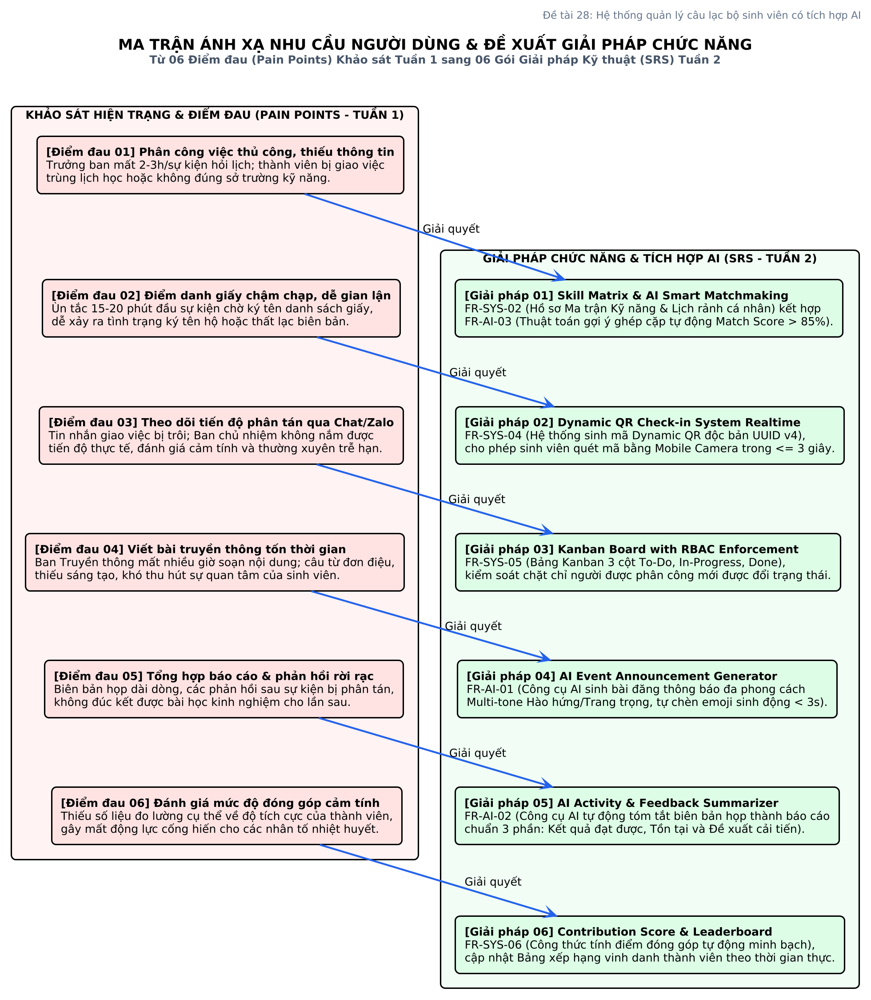

*Hình 1.4: Ánh xạ 06 Điểm đau (Pain Points) sang Giải pháp Chức năng & AI*

`plantuml
@startuml painpoint_to_solution
!theme plain
skinparam backgroundColor #FFFFFF
skinparam shadowing false
skinparam roundcorner 8

rectangle "Khảo sát Thực trạng (Pain Points - Tuần 1)" as PainPoints #FEE2E2 {
    rectangle "Phân công thủ công, sai kỹ năng & trùng lịch" as P1
    rectangle "Điểm danh giấy chậm, dễ gian lận" as P2
    rectangle "Quản lý task phân tán qua chat, trễ hạn" as P3
    rectangle "Viết bài truyền thông tốn thời gian" as P4
    rectangle "Tóm tắt báo cáo & phản hồi rời rạc" as P5
    rectangle "Đánh giá đóng góp cảm tính" as P6
}

rectangle "Giải pháp Chức năng (SRS Requirements - Tuần 2)" as Solutions #DCFCE7 {
    rectangle "FR-SYS-02 Skill Matrix + FR-AI-03 AI Matchmaking" as S1
    rectangle "FR-SYS-04 Dynamic QR Check-in System" as S2
    rectangle "FR-SYS-05 Kanban Task Board + RBAC" as S3
    rectangle "FR-AI-01 AI Event Announcement Generator" as S4
    rectangle "FR-AI-02 AI Activity & Feedback Summarizer" as S5
    rectangle "FR-SYS-06 Contribution Score & Leaderboard" as S6
}

P1 --> S1
P2 --> S2
P3 --> S3
P4 --> S4
P5 --> S5
P6 --> S6
@enduml
```

---

## CHƯƠNG 2: PHÂN TÍCH YÊU CẦU CHỨC NĂNG (FUNCTIONAL REQUIREMENTS - TUẦN 2)

Trong **Tuần 2**, nhóm tiến hành chuẩn hóa và phân loại các yêu cầu chức năng thành 2 nhóm lớn:

### 2.1 Nhóm Yêu cầu Chức năng Nghiệp vụ Quản lý Hệ thống (FR-SYS)

| Mã Yêu cầu | Tên Chức năng | Mô tả Chi tiết Nghiệp vụ | Tác nhân & Phân quyền |
| :--- | :--- | :--- | :--- |
| **FR-SYS-01** | **Đăng nhập & Phân quyền RBAC** | Xác thực tài khoản Email/Password, cấp token JWT, phân quyền 3 vai trò (`ADMIN`, `LEADER`, `MEMBER`). Kiểm soát truy cập chuẩn API semantics:<br>- Trả về **`HTTP 401 Unauthorized`** nếu chưa xác thực hoặc token JWT không hợp lệ / hết hạn.<br>- Trả về **`HTTP 403 Forbidden`** nếu đã xác thực thành công nhưng không đủ quyền thực hiện thao tác. | Tất cả Tác nhân |
| **FR-SYS-02** | **Quản lý Hồ sơ, Skill & Free Slots** | Thành viên cập nhật thông tin cá nhân, Ma trận Kỹ năng chuyên môn (Photoshop, MC, Setup, Content...) và Lịch rảnh cố định các buổi trong tuần (Free Slots). Dữ liệu được xác thực nghiêm ngặt bằng Pydantic Schema. | Thành viên, Admin |
| **FR-SYS-03** | **Quản lý Ban Chuyên môn & Nhân sự** | Ban Chủ nhiệm tạo ban mới, cập nhật mô tả, điều chuyển thành viên giữa các ban (Truyền thông, Sự kiện, Chuyên môn, Đối ngoại...) và bổ nhiệm Trưởng ban. | Ban Chủ nhiệm (Admin) |
| **FR-SYS-04** | **Quản lý Sự kiện & Điểm danh QR** | Tạo sự kiện mới, tự động sinh mã QR Code độc bản. Cho phép thành viên quét mã QR trên điện thoại để ghi nhận điểm danh tức thì, chống điểm danh trùng lặp bằng ràng buộc khóa duy nhất trên PostgreSQL. | Trưởng ban, Thành viên |
| **FR-SYS-05** | **Quản lý Nhiệm vụ & Kanban Board** | Quản lý vòng đời task qua 3 cột trạng thái (*To-Do, In-Progress, Done*). Ràng buộc RBAC: Leader giao việc & đổi status mọi task; Member chỉ được đổi status task của mình. | Admin, Leader, Member |
| **FR-SYS-06** | **Thống kê & Bảng xếp hạng Đóng góp** | Tự động tính điểm đóng góp cá nhân và hiển thị Leaderboard TOP thành viên xuất sắc.<br>- *Công thức MVP (KT1/KT2):* Score = (Check-in * 10) + (Task Done * 20).<br>- *Định hướng V2.0:* Bổ sung trọng số độ khó task (W trong [1.0, 2.0]) và hệ số đúng hạn (K trong [0.5, 1.0]). | Tất cả Tác nhân |

### 2.2 Nhóm Yêu cầu Chức năng Trí tuệ Nhân tạo (FR-AI)

#### A. Mã Biểu đồ Mermaid:
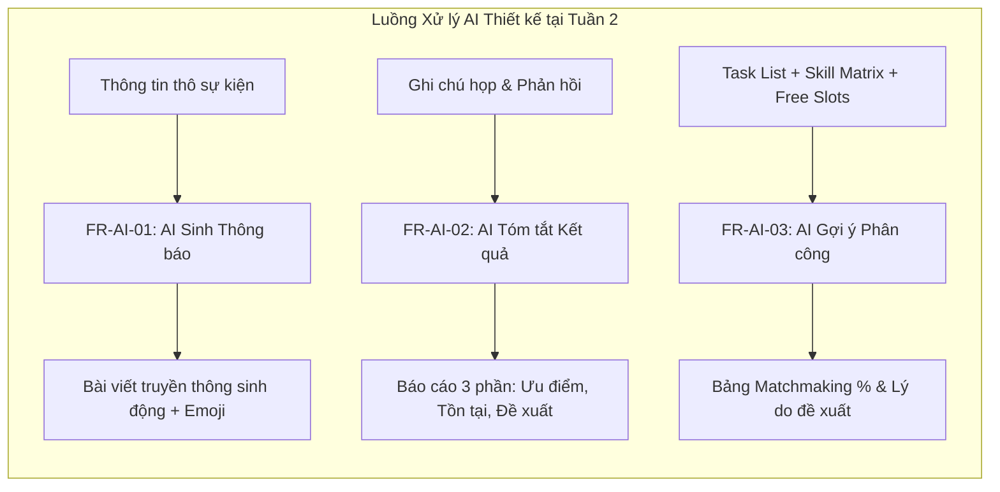
```mermaid
graph LR
    subgraph Luồng Xử lý AI Thiết kế tại Tuần 2
        In1[Thông tin thô sự kiện] --> AI1[FR-AI-01: AI Sinh Thông báo] --> Out1[Bài viết truyền thông sinh động + Emoji]
        In2[Ghi chú họp & Phản hồi] --> AI2[FR-AI-02: AI Tóm tắt Kết quả] --> Out2[Báo cáo 3 phần: Ưu điểm, Tồn tại, Đề xuất]
        In3[Task List + Skill Matrix + Free Slots] --> AI3[FR-AI-03: AI Gợi ý Phân công] --> Out3[Bảng Matchmaking % & Lý do đề xuất]
    end
```

#### B. Mã Biểu đồ PlantUML:
``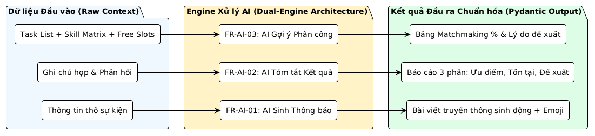

*Hình 2.2: Luồng Kiến trúc Xử lý Dữ liệu 3 Tính năng AI (Smart Matchmaking, Generator, Summarizer)*

`plantuml
@startuml ai_functional_flow
!theme plain
skinparam backgroundColor #FFFFFF
skinparam shadowing false
skinparam roundcorner 8

left to right direction

package "Dữ liệu Đầu vào (Raw Context)" as InputPkg #EFF6FF {
    rectangle "Thông tin thô sự kiện" as In1
    rectangle "Ghi chú họp & Phản hồi" as In2
    rectangle "Task List + Skill Matrix + Free Slots" as In3
}

package "Engine Xử lý AI (Dual-Engine Architecture)" as AIPkg #FEF3C7 {
    rectangle "FR-AI-01: AI Sinh Thông báo" as AI1
    rectangle "FR-AI-02: AI Tóm tắt Kết quả" as AI2
    rectangle "FR-AI-03: AI Gợi ý Phân công" as AI3
}

package "Kết quả Đầu ra Chuẩn hóa (Pydantic Output)" as OutputPkg #DCFCE7 {
    rectangle "Bài viết truyền thông sinh động + Emoji" as Out1
    rectangle "Báo cáo 3 phần: Ưu điểm, Tồn tại, Đề xuất" as Out2
    rectangle "Bảng Matchmaking % & Lý do đề xuất" as Out3
}

In1 --> AI1
AI1 --> Out1

In2 --> AI2
AI2 --> Out2

In3 --> AI3
AI3 --> Out3
@enduml
```

| Mã Yêu cầu | Tên Chức năng AI | Mục đích & Mô tả Xử lý | Dữ liệu Đầu vào / Đầu ra |
| :--- | :--- | :--- | :--- |
| **FR-AI-01** | **AI Sinh Bài đăng Thông báo** | AI đóng vai trò Trưởng ban Truyền thông, phân tích thông tin thô sự kiện để tự động soạn bài đăng mạng xã hội thu hút sinh viên kèm emoji. | **Input:** Tên, Mô tả, Thời gian, Địa điểm, Tone giọng (*Hào hứng, Trang trọng, Thân thiện*).<br>**Output:** Văn bản truyền thông hoàn chỉnh. |
| **FR-AI-02** | **AI Tóm tắt Kết quả Hoạt động** | AI đóng vai trò Thư ký tổng hợp, đọc ghi chú cuộc họp và danh sách ý kiến phản hồi để đúc kết báo cáo tổng kết súc tích. | **Input:** Ghi chú họp, danh sách ý kiến phản hồi.<br>**Output:** Báo cáo 3 phần (*Kết quả nổi bật, Hạn chế, Đề xuất cải tiến*). |
| **FR-AI-03** | **AI Gợi ý Phân công Nhiệm vụ** | AI phân tích độ tương đồng giữa yêu cầu công việc với Kỹ năng & Lịch rảnh của thành viên, kết hợp cân bằng tải để đưa ra danh sách ghép cặp tối ưu. | **Input:** Danh sách Task, Danh sách Kỹ năng & Lịch rảnh thành viên.<br>**Output:** Danh sách gợi ý ghép cặp kèm Match Score (%) và lý do. |

---

## CHƯƠNG 3: PHÂN TÍCH YÊU CẦU PHI CHỨC NĂNG & TIÊU CHÍ NGHIỆM THU (NON-FUNCTIONAL REQUIREMENTS - TUẦN 2)

### 3.1 Bảng Đặc tả Tiêu chuẩn Chất lượng ISO/IEC 25010 kèm Acceptance Criteria & Test Method

| Mã NFR | Nhóm Tiêu chuẩn | Tiêu chí & Chỉ số Đo lường Chi tiết | Phương án Kỹ thuật Thiết kế (Flask + PostgreSQL + Docker) | Tiêu chí Nghiệm thu (Acceptance Criteria) & Phương pháp Kiểm thử (Test Method) |
| :---: | :--- | :--- | :--- | :--- |
| **NFR-PERF-01** | Hiệu năng *(Performance)* | - Thời gian phản hồi API CRUD: **P95 $\le$ 500ms**.<br>- Thời gian xử lý AI Engine: **P95 $\le$ 5.0s** (Cloud LLM) & **P99 $\le$ 500ms** (Local Fallback).<br>- Tốc độ First Contentful Paint (FCP): **< 1.2s**. | Flask WSGI với Gunicorn 4 workers, PostgreSQL Indexing khóa ngoại và Vite code-splitting. | **Test Method:** Postman Runner / Apache Benchmark.<br>**Acceptance:** 95% request API CRUD hoàn thành $\le$ 500ms; FCP đo qua Lighthouse $\le$ 1.2s. |
| **NFR-PERF-02** | Hiệu năng *(Performance)* | - Hỗ trợ ít nhất **200 người dùng truy cập đồng thời (200 Concurrent Users / VUs)** trong đợt cao điểm điểm danh mà không nghẽn hệ thống. | Flask Stateless RESTful API, PostgreSQL Connection Pool (pool_size=10, max_overflow=20) chạy trên Docker. | **Test Method:** Load Testing bằng Locust / k6 (5 phút với 200 VUs trên PostgreSQL Container).<br>**Acceptance:** Error Rate $< 1\%$, P95 latency $< 1.0$s tại mức 200 VUs. |
| **NFR-SEC-01** | Bảo mật *(Security)* | - Mật khẩu người dùng được băm an toàn bằng thuật toán chuyên dụng **bcrypt** ($cost \ge 12$, auto-salted). Tuyệt đối không lưu plaintext. | Module `security.py` sử dụng thư viện `bcrypt` tiêu chuẩn của Python. | **Test Method:** Unit Test Auth & Database Dump Security Audit.<br>**Acceptance:** 100% mật khẩu được băm bcrypt, không có bất kỳ plaintext password nào trong PostgreSQL. |
| **NFR-SEC-02** | Bảo mật *(Security)* | - Xác thực bằng **JWT (JSON Web Token)** với thời hạn 7 ngày, ký bằng Secret Key 256-bit. | Middleware `@jwt_required` xác thực JWT trên từng request qua Authorization Header. | **Test Method:** Integration Test với Token hợp lệ, Token hết hạn, Token giả mạo.<br>**Acceptance:** Trả về đúng `HTTP 401 Unauthorized` khi token không hợp lệ hoặc hết hạn. |
| **NFR-SEC-03** | Bảo mật *(Security)* | - Phân quyền **RBAC nghiêm ngặt tại Backend (API Level)**. Chặn Member đổi task của người khác. | Decorator `@roles_required` kết hợp kiểm tra Task Owner trong Flask Blueprint. | **Test Method:** Security API Test giả lập Member gửi lệnh PUT/DELETE task của người khác.<br>**Acceptance:** Hệ thống từ chối và trả về đúng `HTTP 403 Forbidden`. |
| **NFR-SEC-04** | Bảo mật AI *(AI Security)* | - Phòng thủ **Prompt Injection**, chống rò rỉ dữ liệu nhạy cảm và kiểm soát tính toàn vẹn đầu ra của AI. | Thiết kế 5 tầng bảo vệ: Phân tách Context, Giới hạn dữ liệu, Sanitization, Pydantic Output Validation, Human-in-the-loop. | **Test Method:** Adversarial Prompt Injection Test suites.<br>**Acceptance:** AI không thực thi lệnh override ("Ignore instructions"), không làm lộ system context. |
| **NFR-REL-01** | Độ tin cậy *(Reliability)* | - Độ sẵn sàng của hệ thống (**Uptime**) đạt tối thiểu **99.5%** trong suốt kỳ vận hành. | Đóng gói Docker Container độc lập, cơ chế restart policy `always` và logging tập trung. | **Test Method:** Continuous Health-check Endpoint Monitoring `/api/health`.<br>**Acceptance:** Uptime đo lường đạt $\ge 99.5\%$. |
| **NFR-REL-02** | Độ tin cậy *(Reliability)* | - **Cơ chế chịu lỗi Dual-Engine Fallback:** Hệ thống tự động chuyển sang **Local Rule-based Fallback Engine** khi mất mạng hoặc hết quota API. | Dual-Engine: Google Gemini Cloud LLM + Local Rule-based Matcher. | **Test Method:** Ngắt kết nối mạng Internet khi gọi chức năng AI.<br>**Acceptance:** Hệ thống chuyển sang Fallback trong $< 100$ms và trả về kết quả hợp lệ. |
| **NFR-REL-03** | Tính toàn vẹn *(Data Integrity)* | - Ràng buộc khóa ngoại `ON DELETE SET NULL`, `UNIQUE(activity_id, user_id)` chống điểm danh trùng. | Ràng buộc toàn vẹn cơ sở dữ liệu trên PostgreSQL Data Models. | **Test Method:** Database Constraint Testing.<br>**Acceptance:** PostgreSQL báo lỗi IntegrityError khi cố ý ghi dữ liệu trùng lặp. |
| **NFR-USA-01** | Trải nghiệm *(Usability)* | - Giao diện chuẩn **Responsive Web Design**, hiển thị tối ưu trên Desktop, Tablet và Mobile. | Thiết kế CSS Component System theo nguyên lý Mobile-First, độ tương phản WCAG 2.1. | **Test Method:** Cross-Device Testing trên Chrome DevTools (Desktop, iPad, iPhone/Android).<br>**Acceptance:** Không bị tràn màn hình ngang (horizontal scrollbar) trên màn hình $\ge 360$px. |
| **NFR-USA-02** | Trải nghiệm *(Usability)* | - Thao tác đạt chuẩn **3-Click Rule**; tích hợp nút Quick Demo Login và Toast Notification tức thì. | Tối ưu hóa luồng tương tác UX, cung cấp tài khoản thử nghiệm nhanh cho từng vai trò. | **Test Method:** Usability Testing & User Walkthrough.<br>**Acceptance:** Người dùng truy cập bất kỳ tính năng chính nào trong không quá 3 lượt click. |
| **NFR-MNT-01** | Bảo trì *(Maintainability)*| - Mã nguồn phân tầng rõ ràng (Flask Blueprint $
ightarrow$ Service $
ightarrow$ Model $
ightarrow$ Pydantic Schema). | Tuân thủ nguyên lý Clean Architecture & Separation of Concerns. | **Test Method:** Static Code Analysis & Peer Review.<br>**Acceptance:** 100% Endpoint tuân thủ cấu trúc phân tầng và quy ước Pydantic. |
| **NFR-MNT-02** | Khả năng triển khai *(Deployability & Containerization)* | - Hệ thống được đóng gói hoàn chỉnh bằng **Docker & Docker Compose** (PostgreSQL + Flask Backend + React-Vite Frontend). | Tối ưu hóa multi-stage build trong Dockerfile cho Frontend (Nginx) và Backend (Python 3.11 Slim). | **Test Method:** Triển khai tự động bằng lệnh `docker-compose up --build`.<br>**Acceptance:** 100% Core Regression Suite (25+ test cases) pass thành công trên môi trường Dockerized PostgreSQL. |
| **NFR-COMP-01**| Tương thích *(Compatibility)*| - Tương thích hoàn toàn với tất cả các trình duyệt hiện đại (Chrome, Edge, Firefox, Safari). | Tuân thủ chuẩn HTML5, CSS3 và ECMAScript 6+. | **Test Method:** Cross-Browser Testing trên Chrome, Edge, Safari, Firefox.<br>**Acceptance:** Mọi tính năng hoạt động đồng nhất, không phát sinh lỗi script trên Console. |

### 3.2 Đặc tả Cơ chế Bảo mật AI & Phòng chống Prompt Injection Đa tầng
Để giải quyết triệt để rủi ro bảo mật mô hình ngôn ngữ lớn (LLM Security Risks), hệ thống áp dụng chiến lược phòng thủ 5 tầng:
1. **Strict Context Separation (Phân tách ngữ cảnh nghiêm ngặt):** Tách bạch hoàn toàn giữa `System Instructions` và `User Input` qua cấu trúc Message Object chuẩn (`role: system`, `role: user`).
2. **Data Minimization & Boundary Limiting (Thu hẹp phạm vi dữ liệu):** Chỉ cung cấp trường dữ liệu cần thiết cho AI; tuyệt đối không gửi mật khẩu, JWT token, email nhạy cảm hay API keys vào prompt.
3. **Input Sanitization & Length Guard (Lọc đầu vào & Giới hạn độ dài):** Giới hạn độ dài, escape các chuỗi delimiter nhằm chặn các câu lệnh override chỉ thị.
4. **Output Schema Validation (Kiểm tra cấu trúc đầu ra):** Sử dụng Pydantic Schema để ép kiểu và xác thực chặt chẽ định dạng JSON từ AI trước khi xử lý.
5. **Least Privilege & Human-in-the-loop (Kiểm soát quyền & Xác nhận của con người):** AI chỉ đề xuất tư vấn; mọi quyết định quan trọng (gán việc, đăng bài) đều cần Leader/Admin phê duyệt.

---

## CHƯƠNG 4: MÔ HÌNH HÓA CA SỬ DỤNG (USE CASE MODELING - TUẦN 3)

### 4.1 Danh mục Phân rã 12 Use Cases Cốt lõi

| STT | Mã Use Case | Tên Ca Sử dụng (Use Case Name) | Phân hệ (Subsystem / Package) | Tác nhân chính (Primary Actor) | Tác nhân hỗ trợ / Kỹ thuật |
| :---: | :---: | :--- | :--- | :--- | :--- |
| **01** | `UC01` | Đăng nhập & Xác thực JWT | Quản trị Hệ thống & Phân quyền | Người dùng (All Users) | Database Subsystem |
| **02** | `UC02` | Cập nhật Hồ sơ, Skill Matrix & Lịch rảnh | Quản lý Thành viên & Ban | Thành viên, Admin | Database Subsystem |
| **03** | `UC03` | Tra cứu Lịch sử Hoạt động & Leaderboard | Trợ lý AI & Báo cáo Thống kê | Người dùng (All Users) | Database Subsystem |
| **04** | `UC04` | Quản lý Sự kiện & Sinh mã QR Độc bản | Sự kiện & Điểm danh QR | Trưởng ban, Admin | Database Subsystem |
| **05** | `UC05` | Quản lý Nhiệm vụ & Kanban Board | Quản lý Nhiệm vụ & Kanban | Trưởng ban, Admin | Database Subsystem |
| **06** | `UC06` | AI Gợi ý Phân công Nhiệm vụ Thông minh | Trợ lý AI & Báo cáo Thống kê | Trưởng ban, Admin | Cloud LLM / Fallback Engine |
| **07** | `UC07` | AI Sinh Bài đăng Thông báo Sự kiện | Trợ lý AI & Báo cáo Thống kê | Trưởng ban, Admin | Cloud LLM / Fallback Engine |
| **08** | `UC08` | AI Tóm tắt Kết quả Hoạt động & Phản hồi | Trợ lý AI & Báo cáo Thống kê | Trưởng ban, Admin | Cloud LLM / Fallback Engine |
| **09** | `UC09` | Quét mã QR Điểm danh Sự kiện | Sự kiện & Điểm danh QR | Thành viên | Database Subsystem |
| **10** | `UC10` | Cập nhật Tiến độ Task của bản thân | Quản lý Nhiệm vụ & Kanban | Thành viên | Database Subsystem |
| **11** | `UC11` | Quản lý Cơ cấu Ban Chuyên môn | Quản lý Thành viên & Ban | Ban Chủ nhiệm (Admin) | Database Subsystem |
| **12** | `UC12` | Quản lý & Phân quyền Thành viên | Quản trị Hệ thống & Phân quyền | Ban Chủ nhiệm (Admin) | Database Subsystem |

### 4.2 Biểu đồ Use Case Tổng thể Toàn Hệ thống (System Use Case Diagram)

#### A. Mã Biểu đồ Mermaid:

```mermaid
flowchart TD
    User([fa:fa-user Người dùng chung])
    Admin([fa:fa-user-tie Ban Chủ nhiệm / Admin])
    Leader([fa:fa-user-shield Trưởng ban / Leader])
    Member([fa:fa-user-graduate Thành viên / Member])
    AIService([fa:fa-robot Google Gemini AI API / Fallback])

    Admin -->|Thừa kế| User
    Leader -->|Thừa kế| User
    Member -->|Thừa kế| User

    subgraph Sub1["[Package 1] Phân hệ Xác thực & Phân quyền (Auth & RBAC)"]
        UC01(["UC01: Đăng nhập & Xác thực JWT"])
        UC12(["UC12: Quản lý & Phân quyền Tài khoản"])
        UC_V(["<<include>> Xác thực JWT Token & Phân quyền"])
    end

    subgraph Sub2["[Package 2] Phân hệ Quản lý Thành viên & Ban Chuyên môn"]
        UC02(["UC02: Cập nhật Hồ sơ, Skill & Free Slots"])
        UC11(["UC11: Quản lý Cơ cấu Ban Chuyên môn"])
    end

    subgraph Sub3["[Package 3] Phân hệ Quản lý Sự kiện & Điểm danh QR"]
        UC04(["UC04: Quản lý Sự kiện & Sinh mã QR"])
        UC09(["UC09: Quét mã QR Điểm danh"])
        UC_QR(["<<include>> Sinh chuỗi định danh QR độc bản"])
    end

    subgraph Sub4["[Package 4] Phân hệ Quản lý Nhiệm vụ & Kanban Board"]
        UC05(["UC05: Quản lý Nhiệm vụ & Kanban Board"])
        UC10(["UC10: Cập nhật Tiến độ Task của mình"])
        UC_RBAC(["<<include>> Kiểm tra quyền sở hữu Task"])
    end

    subgraph Sub5["[Package 5] Phân hệ Trợ lý AI & Báo cáo Thống kê"]
        UC06(["UC06: AI Gợi ý Phân công Nhiệm vụ"])
        UC07(["UC07: AI Sinh Bài đăng Thông báo"])
        UC08(["UC08: AI Tóm tắt Kết quả Hoạt động"])
        UC03(["UC03: Tra cứu Lịch sử & Leaderboard"])
    end

    User --- UC01
    User --- UC03

    Member --- UC02
    Member --- UC09
    Member --- UC10

    Leader --- UC04
    Leader --- UC05
    Leader --- UC06
    Leader --- UC07
    Leader --- UC08

    Admin --- UC11
    Admin --- UC12

    AIService --- UC06
    AIService --- UC07
    AIService --- UC08

    UC04 -.->|<<include>>| UC_QR
    UC09 -.->|<<include>>| UC_V
    UC10 -.->|<<include>>| UC_RBAC
    UC05 -.->|<<extend>>| UC06
    UC04 -.->|<<extend>>| UC07
```

#### B. Mã Biểu đồ PlantUML ([`docs/plantuml/usecase_overall.puml`](file:///D:/DTC245200328/Nam3/Ki1/UngDungAI/Student_Club_Management/docs/plantuml/usecase_overall.puml)):
``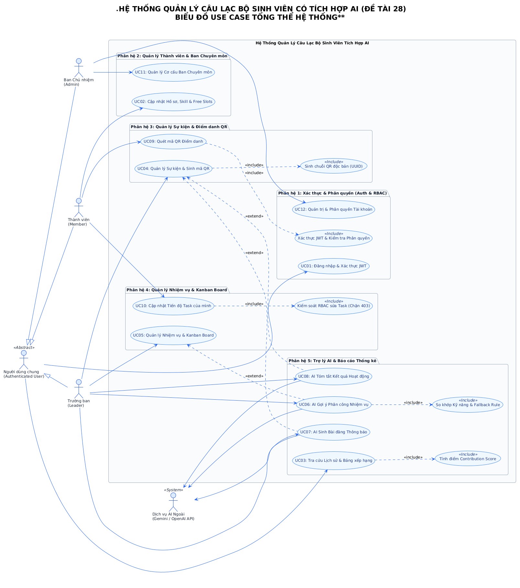

*Hình 4.2: Biểu đồ Ca Sử dụng Tổng thể (System Use Case Diagram - 4 Tác nhân, 12 Use Cases)*

`plantuml
@startuml usecase_overall
!theme plain
skinparam backgroundColor #FFFFFF
skinparam shadowing false
skinparam roundcorner 10
skinparam defaultFontName "Segoe UI"
skinparam defaultFontSize 12

skinparam package {
    BackgroundColor #F8FAFC
    BorderColor #94A3B8
    FontColor #0F172A
    FontStyle bold
}

skinparam usecase {
    BackgroundColor #EFF6FF
    BorderColor #3B82F6
    FontColor #1E3A8A
    ArrowColor #2563EB
}

skinparam actor {
    BackgroundColor #DBEAFE
    BorderColor #1D4ED8
    FontColor #1E293B
}

left to right direction
title **HỆ THỐNG QUẢN LÝ CÂU LẠC BỘ SINH VIÊN CÓ TÍCH HỢP AI (ĐỀ TÀI 28)\nBIỂU ĐỒ USE CASE TỔNG THỂ HỆ THỐNG**

' ==========================================
' ACTORS
' ==========================================
actor "Người dùng chung\n(Authenticated User)" as User <<Abstract>>
actor "Ban Chủ nhiệm\n(Admin)" as Admin
actor "Trưởng ban\n(Leader)" as Leader
actor "Thành viên\n(Member)" as Member
actor "Dịch vụ AI Ngoài\n(Gemini / OpenAI API)" as AIService <<System>>

' Actor Inheritance
Admin -up-|> User
Leader -up-|> User
Member -up-|> User

' ==========================================
' SUBSYSTEM PACKAGES & USE CASES
' ==========================================
rectangle "Hệ Thống Quản Lý Câu Lạc Bộ Sinh Viên Tích Hợp AI" {

    package "Phân hệ 1: Xác thực & Phân quyền (Auth & RBAC)" {
        usecase "UC01: Đăng nhập & Xác thực JWT" as UC01
        usecase "UC12: Quản trị & Phân quyền Tài khoản" as UC12
        usecase "Xác thực JWT & Kiểm tra Phân quyền" as UC_Auth <<Include>>
    }

    package "Phân hệ 2: Quản lý Thành viên & Ban Chuyên môn" {
        usecase "UC02: Cập nhật Hồ sơ, Skill & Free Slots" as UC02
        usecase "UC11: Quản lý Cơ cấu Ban Chuyên môn" as UC11
    }

    package "Phân hệ 3: Quản lý Sự kiện & Điểm danh QR" {
        usecase "UC04: Quản lý Sự kiện & Sinh mã QR" as UC04
        usecase "UC09: Quét mã QR Điểm danh" as UC09
        usecase "Sinh chuỗi QR độc bản (UUID)" as UC_GenQR <<Include>>
    }

    package "Phân hệ 4: Quản lý Nhiệm vụ & Kanban Board" {
        usecase "UC05: Quản lý Nhiệm vụ & Kanban Board" as UC05
        usecase "UC10: Cập nhật Tiến độ Task của mình" as UC10
        usecase "Kiểm soát RBAC sửa Task (Chặn 403)" as UC_RBAC <<Include>>
    }

    package "Phân hệ 5: Trợ lý AI & Báo cáo Thống kê" {
        usecase "UC06: AI Gợi ý Phân công Nhiệm vụ" as UC06
        usecase "UC07: AI Sinh Bài đăng Thông báo" as UC07
        usecase "UC08: AI Tóm tắt Kết quả Hoạt động" as UC08
        usecase "UC03: Tra cứu Lịch sử & Bảng xếp hạng" as UC03
        usecase "So khớp Kỹ năng & Fallback Rule" as UC_Match <<Include>>
        usecase "Tính điểm Contribution Score" as UC_Score <<Include>>
    }
}

' ==========================================
' RELATIONSHIPS & ASSOCIATIONS
' ==========================================

' General User
User --> UC01
User --> UC03

' Member
Member --> UC02
Member --> UC09
Member --> UC10

' Leader
Leader --> UC04
Leader --> UC05
Leader --> UC06
Leader --> UC07
Leader --> UC08

' Admin
Admin --> UC11
Admin --> UC12

' Include Relationships
UC04 ..> UC_GenQR : <<include>>
UC09 ..> UC_Auth : <<include>>
UC10 ..> UC_RBAC : <<include>>
UC06 ..> UC_Match : <<include>>
UC03 ..> UC_Score : <<include>>

' Extend Relationships
UC05 <.. UC06 : <<extend>>
UC04 <.. UC07 : <<extend>>
UC04 <.. UC08 : <<extend>>

' AI Service interactions
AIService <-- UC06
AIService <-- UC07
AIService <-- UC08

@enduml
```

---

### 4.3 Biểu đồ Use Case Chi tiết theo từng Phân hệ (Subsystem Use Case Diagrams)

#### 4.3.1 Phân hệ 1: Quản trị Tài khoản & Phân quyền Hệ thống (Authentication & RBAC Subsystem)
``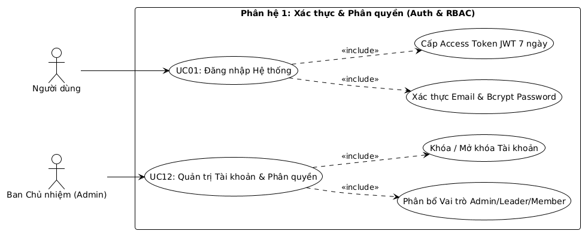

*Hình 4.3.1: Use Case Phân hệ Xác thực & Phân quyền RBAC (UC01, UC12)*

`plantuml
@startuml usecase_sub1_auth
!theme plain
skinparam backgroundColor #FFFFFF
skinparam shadowing false
skinparam roundcorner 8

left to right direction
actor "Người dùng" as User
actor "Ban Chủ nhiệm (Admin)" as Admin

rectangle "Phân hệ 1: Xác thực & Phân quyền (Auth & RBAC)" {
    usecase "UC01: Đăng nhập Hệ thống" as UC01
    usecase "Xác thực Email & Bcrypt Password" as UC01_P
    usecase "Cấp Access Token JWT 7 ngày" as UC01_JWT
    usecase "UC12: Quản trị Tài khoản & Phân quyền" as UC12
    usecase "Phân bổ Vai trò Admin/Leader/Member" as UC12_Role
    usecase "Khóa / Mở khóa Tài khoản" as UC12_Lock
}

User --> UC01
UC01 ..> UC01_P : <<include>>
UC01 ..> UC01_JWT : <<include>>

Admin --> UC12
UC12 ..> UC12_Role : <<include>>
UC12 ..> UC12_Lock : <<include>>
@enduml
```

#### 4.3.2 Phân hệ 2: Quản lý Hồ sơ Thành viên & Ban Chuyên môn (Member & Department Subsystem)
``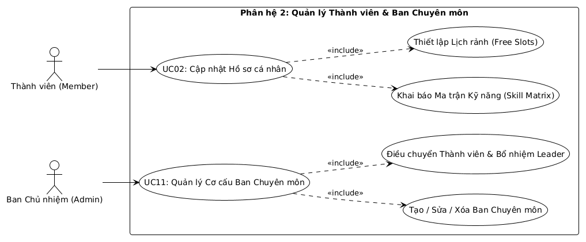

*Hình 4.3.2: Use Case Phân hệ Hồ sơ Thành viên, Skill Matrix & Ban Chuyên môn (UC02, UC11)*

`plantuml
@startuml usecase_sub2_member
!theme plain
skinparam backgroundColor #FFFFFF
skinparam shadowing false
skinparam roundcorner 8

left to right direction
actor "Thành viên (Member)" as Member
actor "Ban Chủ nhiệm (Admin)" as Admin

rectangle "Phân hệ 2: Quản lý Thành viên & Ban Chuyên môn" {
    usecase "UC02: Cập nhật Hồ sơ cá nhân" as UC02
    usecase "Khai báo Ma trận Kỹ năng (Skill Matrix)" as UC02_Skill
    usecase "Thiết lập Lịch rảnh (Free Slots)" as UC02_Slot
    usecase "UC11: Quản lý Cơ cấu Ban Chuyên môn" as UC11
    usecase "Tạo / Sửa / Xóa Ban Chuyên môn" as UC11_Dept
    usecase "Điều chuyển Thành viên & Bổ nhiệm Leader" as UC11_Assign
}

Member --> UC02
UC02 ..> UC02_Skill : <<include>>
UC02 ..> UC02_Slot : <<include>>

Admin --> UC11
UC11 ..> UC11_Dept : <<include>>
UC11 ..> UC11_Assign : <<include>>
@enduml
```

#### 4.3.3 Phân hệ 3: Quản lý Sự kiện & Điểm danh QR Độc bản (Event & QR Check-in Subsystem)
``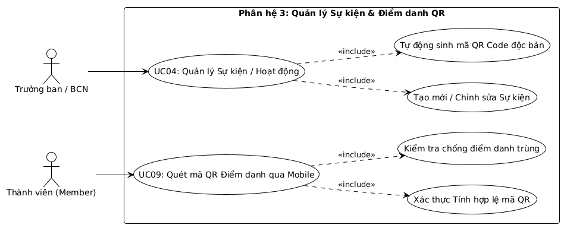

*Hình 4.3.3: Use Case Phân hệ Quản lý Sự kiện & Điểm danh QR Độc bản (UC04, UC09)*

`plantuml
@startuml usecase_sub3_event
!theme plain
skinparam backgroundColor #FFFFFF
skinparam shadowing false
skinparam roundcorner 8

left to right direction
actor "Trưởng ban / BCN" as Leader
actor "Thành viên (Member)" as Member

rectangle "Phân hệ 3: Quản lý Sự kiện & Điểm danh QR" {
    usecase "UC04: Quản lý Sự kiện / Hoạt động" as UC04
    usecase "Tạo mới / Chỉnh sửa Sự kiện" as UC04_Create
    usecase "Tự động sinh mã QR Code độc bản" as UC04_QR
    usecase "UC09: Quét mã QR Điểm danh qua Mobile" as UC09
    usecase "Xác thực Tính hợp lệ mã QR" as UC09_Verify
    usecase "Kiểm tra chống điểm danh trùng" as UC09_Unique
}

Leader --> UC04
UC04 ..> UC04_Create : <<include>>
UC04 ..> UC04_QR : <<include>>

Member --> UC09
UC09 ..> UC09_Verify : <<include>>
UC09 ..> UC09_Unique : <<include>>
@enduml
```

#### 4.3.4 Phân hệ 4: Quản lý Nhiệm vụ & Bảng Kanban (Kanban Task Management Subsystem)
``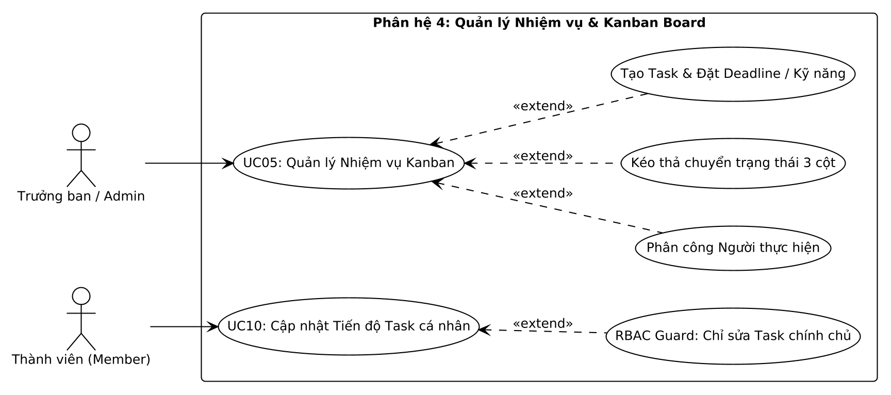

*Hình 4.3.4: Use Case Phân hệ Quản lý Nhiệm vụ & Kanban Board (UC05, UC10)*

`plantuml
@startuml usecase_sub4_task
!theme plain
skinparam backgroundColor #FFFFFF
skinparam shadowing false
skinparam roundcorner 8

left to right direction
actor "Trưởng ban / Admin" as Leader
actor "Thành viên (Member)" as Member

rectangle "Phân hệ 4: Quản lý Nhiệm vụ & Kanban Board" {
    usecase "UC05: Quản lý Nhiệm vụ Kanban" as UC05
    usecase "Tạo Task & Đặt Deadline / Kỹ năng" as UC05_Create
    usecase "Phân công Người thực hiện" as UC05_Assign
    usecase "Kéo thả chuyển trạng thái 3 cột" as UC05_Move
    usecase "UC10: Cập nhật Tiến độ Task cá nhân" as UC10
    usecase "RBAC Guard: Chỉ sửa Task chính chủ" as UC10_RBAC
}

Leader --> UC05
UC05 ..> UC05_Create : <<include>>
UC05 ..> UC05_Assign : <<include>>
UC05 ..> UC05_Move : <<include>>

Member --> UC10
UC10 ..> UC10_RBAC : <<include>>
@enduml
```

#### 4.3.5 Phân hệ 5: Trợ lý Trí tuệ Nhân tạo & Báo cáo Thống kê (AI Services & Analytics Subsystem)
``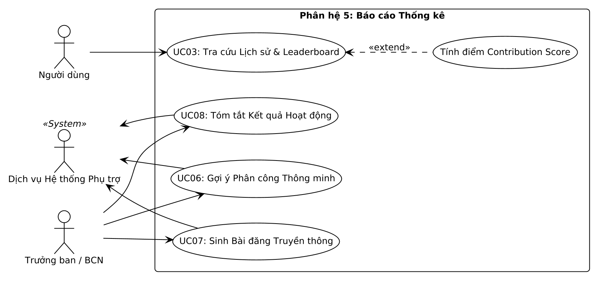

*Hình 4.3.5: Use Case Phân hệ Trợ lý AI & Báo cáo Thống kê (UC03, UC06, UC07, UC08)*

`plantuml
@startuml usecase_sub5_ai
!theme plain
skinparam backgroundColor #FFFFFF
skinparam shadowing false
skinparam roundcorner 8

left to right direction
actor "Trưởng ban / BCN" as Leader
actor "Người dùng" as User
actor "AI Service (Gemini/Fallback)" as AI <<System>>

rectangle "Phân hệ 5: Trợ lý AI & Báo cáo Thống kê" {
    usecase "UC06: AI Gợi ý Phân công Thông minh" as UC06
    usecase "UC07: AI Sinh Bài đăng Truyền thông" as UC07
    usecase "UC08: AI Tóm tắt Kết quả Hoạt động" as UC08
    usecase "UC03: Tra cứu Lịch sử & Leaderboard" as UC03
    usecase "Tính điểm Contribution Score" as UC_Score
}

Leader --> UC06
Leader --> UC07
Leader --> UC08
User --> UC03

AI <-- UC06
AI <-- UC07
AI <-- UC08

UC03 ..> UC_Score : <<include>>
@enduml
```

---

### 4.4 Bảng Đặc tả Ca Sử dụng Mẫu Chi tiết (Use Case Specifications)

#### 4.4.1 Use Case Specification 01: Quản lý Sự kiện & Sinh mã QR Điểm danh (UC04 / FR-SYS-04)

| Thuộc tính | Nội dung Chi tiết |
| :--- | :--- |
| **Mã Use Case** | `UC-SPEC-01` (Tương ứng `FR-SYS-04` / `UC04`) |
| **Tên Use Case** | Quản lý Sự kiện & Sinh mã QR Điểm danh Độc bản |
| **Tác nhân chính** | Trưởng ban (`LEADER`), Ban Chủ nhiệm (`ADMIN`) |
| **Tiền điều kiện** | Người dùng đã đăng nhập thành công với vai trò Leader hoặc Admin. |
| **Hậu điều kiện** | Sự kiện mới được tạo trong CSDL PostgreSQL kèm chuỗi mã QR Code độc bản và hiển thị trên Dashboard. |
| **Luồng sự kiện chính (Main Flow)** | 1. Người dùng chọn chức năng "Quản lý Sự kiện" $
ightarrow$ Nhấn "Tạo Sự kiện mới".<br>2. Hệ thống hiển thị biểu mẫu (Tên sự kiện, Ban tổ chức, Thời gian bắt đầu/kết thúc, Địa điểm, Mô tả).<br>3. Người dùng nhập thông tin hợp lệ và nhấn "Lưu sự kiện".<br>4. Hệ thống sinh mã nhận diện duy nhất (`activity_id`), tự động tạo chuỗi định danh QR độc bản.<br>5. Hệ thống lưu sự kiện vào PostgreSQL và kết xuất hình ảnh mã QR Code lên màn hình để Leader trình chiếu. |
| **Luồng rẽ nhánh (Alternative Flow)** | 3a. Người dùng muốn cập nhật thông tin sự kiện cũ: Chọn sự kiện $
ightarrow$ Sửa thông tin $
ightarrow$ Hệ thống cập nhật và giữ nguyên mã QR ban đầu. |
| **Luồng ngoại lệ (Exception Flow)** | 3b. Người dùng nhập thiếu trường bắt buộc hoặc thời gian kết thúc trước thời gian bắt đầu: Hệ thống hiển thị thông báo lỗi Validation (Pydantic) và yêu cầu nhập lại. |
| **Quy tắc nghiệp vụ (Business Rules)** | - Mã QR là độc bản cho từng sự kiện.<br>- Chỉ tài khoản có vai trò Leader hoặc Admin mới có quyền tạo sự kiện và lấy mã QR. |

#### 4.4.2 Use Case Specification 02: Quản lý Nhiệm vụ qua Kanban Board & Siết chặt RBAC (UC05 & UC10 / FR-SYS-05)

| Thuộc tính | Nội dung Chi tiết |
| :--- | :--- |
| **Mã Use Case** | `UC-SPEC-02` (Tương ứng `FR-SYS-05` / `UC05` & `UC10`) |
| **Tên Use Case** | Quản lý Nhiệm vụ, Phân công & Cập nhật Trạng thái Kanban Board |
| **Tác nhân chính** | Ban Chủ nhiệm (`ADMIN`), Trưởng ban (`LEADER`), Thành viên (`MEMBER`) |
| **Tiền điều kiện** | Người dùng đã đăng nhập với JWT hợp lệ; sự kiện hoặc ban chuyên môn đã tồn tại. |
| **Hậu điều kiện** | Trạng thái nhiệm vụ được cập nhật trên Kanban Board và đồng bộ vào PostgreSQL. |
| **Luồng sự kiện chính (Main Flow)** | 1. Người dùng mở màn hình "Kanban Board" của Ban/Sự kiện.<br>2. Hệ thống tải danh sách nhiệm vụ phân bố theo 3 cột: *To-Do, In-Progress, Done*.<br>3. Người dùng kéo-thả task hoặc đổi trạng thái task sang cột mới.<br>4. Hệ thống kiểm tra quyền hạn (RBAC):<br>   - Nếu là Admin/Leader: Cho phép thay đổi trạng thái mọi task và gán người làm.<br>   - Nếu là Member: Chỉ cho phép đổi trạng thái của task do chính mình phụ trách (`assignee_id == current_user.id`).<br>5. Hệ thống cập nhật PostgreSQL và hiển thị thông báo Toast thành công. |
| **Luồng rẽ nhánh (Alternative Flow)** | 3a. Trưởng ban tạo task mới: Nhấn "Thêm Task" $
ightarrow$ Nhập tiêu đề, deadline, chọn thành viên phụ trách $
ightarrow$ Task xuất hiện tại cột *To-Do*. |
| **Luồng ngoại lệ (Exception Flow)** | 4a. Thành viên cố ý gọi API sửa task của người khác: Backend chặn và trả về mã lỗi `HTTP 403 Forbidden` kèm thông báo "Bạn không có quyền chỉnh sửa nhiệm vụ này". |
| **Quy tắc nghiệp vụ (Business Rules)** | - Thành viên thường không được quyền tạo task mới hoặc đổi người phụ trách task.<br>- Khi task chuyển sang *Done*, hệ thống ghi nhận thời điểm hoàn thành để phục vụ tính điểm đóng góp. |

#### 4.4.3 Use Case Specification 03: AI Gợi ý Phân công Nhiệm vụ Thông minh (UC06 / FR-AI-03)

| Thuộc tính | Nội dung Chi tiết |
| :--- | :--- |
| **Mã Use Case** | `UC-SPEC-03` (Tương ứng `FR-AI-03` / `UC06`) |
| **Tên Use Case** | AI Gợi ý Phân công Nhiệm vụ Thông minh (Smart Matchmaking) |
| **Tác nhân chính** | Trưởng ban (`LEADER`), Ban Chủ nhiệm (`ADMIN`), External AI Service |
| **Tiền điều kiện** | Đã có danh sách nhiệm vụ cần làm và hồ sơ thành viên có đăng ký Skill Matrix & Lịch rảnh. |
| **Hậu điều kiện** | Bảng đề xuất ghép cặp nhân sự kèm Match Score (%) và lý do rõ ràng được hiển thị cho Leader duyệt. |
| **Luồng sự kiện chính (Main Flow)** | 1. Trưởng ban truy cập màn hình phân công nhiệm vụ $
ightarrow$ Nhấn nút "AI Gợi ý Phân công".<br>2. Backend Flask thu thập danh sách Task chưa phân công cùng Ma trận Kỹ năng & Lịch rảnh của các thành viên trong Ban.<br>3. Backend đóng gói Context chuẩn hóa và gửi yêu cầu tới AI Engine.<br>4. AI Engine tính toán độ tương đồng kỹ năng, kiểm tra trùng lịch, cân bằng tải công việc và sinh danh sách gợi ý.<br>5. Backend validate định dạng JSON qua Pydantic và trả về giao diện bảng gợi ý ghép cặp kèm Match Score (%) và lý do tường minh.<br>6. Trưởng ban duyệt danh sách: Có thể chấp nhận toàn bộ hoặc chỉnh sửa người phụ trách trước khi nhấn "Áp dụng phân công". |
| **Luồng rẽ nhánh (Alternative Flow)** | 4a. Mất kết nối Internet hoặc lỗi Quota Cloud AI: Hệ thống tự động kích hoạt **Local Rule-based Fallback Engine** dựa trên thuật toán so khớp từ khóa và slot rảnh để trả kết quả ngay lập tức ($< 100$ms). |
| **Luồng ngoại lệ (Exception Flow)** | 2a. Ban chưa có thành viên nào khai báo kỹ năng: Hệ thống hiển thị thông báo hướng dẫn thành viên cập nhật Skill Matrix trước khi dùng AI. |
| **Quy tắc nghiệp vụ (Business Rules)** | - AI chỉ đóng vai trò Trợ lý tư vấn đề xuất, quyết định phân công cuối cùng thuộc về Trưởng ban (Human-in-the-loop).<br>- Toàn bộ lịch sử Prompt và Output được lưu vào bảng `ai_logs` trong PostgreSQL để phục vụ đánh giá và tinh chỉnh. |

### 4.5 Ma trận Phân loại Mức độ Ưu tiên theo Phương pháp MoSCoW

| Phân loại MoSCoW | Danh sách Yêu cầu Chức năng & Phi chức năng Tương ứng | Cam kết Phạm vi Giai đoạn KT2 & KT3 |
| :--- | :--- | :--- |
| **MUST HAVE**<br>*(Bắt buộc cốt lõi)* | - `FR-SYS-01`: Đăng nhập, Xác thực JWT & Phân quyền RBAC 3 vai trò.<br>- `FR-SYS-02`: Quản lý Hồ sơ, Kỹ năng (Skill Matrix) & Lịch rảnh (Free Slots).<br>- `FR-SYS-04`: Quản lý Sự kiện & Điểm danh Mã QR Code độc bản.<br>- `FR-SYS-05`: Quản lý Nhiệm vụ qua Kanban Board & Siết chặt RBAC.<br>- `FR-AI-03`: AI Gợi ý Phân công Nhiệm vụ Thông minh.<br>- `NFR-SEC-01` & `NFR-SEC-03`: Bảo mật mật khẩu (Bcrypt) & RBAC API. | **Cam kết hoàn thành 100% trong Tuần 4 - 6 (KT2)** |
| **SHOULD HAVE**<br>*(Nên có - Giá trị gia tăng)* | - `FR-AI-01`: AI Sinh bài đăng thông báo sự kiện đa phong cách.<br>- `FR-AI-02`: AI Tóm tắt kết quả hoạt động và phản hồi cuộc họp.<br>- `FR-SYS-06`: Thống kê & Bảng xếp hạng Đóng góp (Leaderboard).<br>- `NFR-REL-02`: Cơ chế AI Dual-Engine Fallback (chạy cả Offline & Online).<br>- `NFR-USA-01`: Giao diện Responsive tối ưu trên thiết bị di động. | **Cam kết hoàn thành 100% trong Tuần 6 - 7 (KT2/KT3)** |
| **COULD HAVE**<br>*(Có thể bổ sung sau)* | - Tự động đẩy thông báo bài đăng qua Zalo Official Account / Telegram Bot.<br>- Xuất báo cáo điểm danh và thống kê nhiệm vụ ra file Excel / PDF.<br>- Tính năng bình chọn (Voting/Poll) trực tuyến trong sự kiện. | *Định hướng nghiên cứu mở rộng trong Phiên bản v2.0* |
| **WON'T HAVE**<br>*(Không thực hiện đợt này)* | - Tích hợp cổng thanh toán trực tuyến (VNPay, MoMo) để thu quỹ CLB.<br>- Tính năng Video Call trực tuyến nội bộ trong ứng dụng.<br>- Hệ thống nhận diện khuôn mặt điểm danh (Face ID). | *Không thuộc phạm vi Đề tài 28* |

---

## CHƯƠNG 5: MÔ HÌNH HÓA VÀ THIẾT KẾ HỆ THỐNG BẰNG CÁC BIỂU ĐỒ UML (UML MODELING & SYSTEM DESIGN - TUẦN 3)

### 5.1 Biểu đồ Lớp Phân tích & Thực thể (UML Class Diagram / Domain Entity Model)
``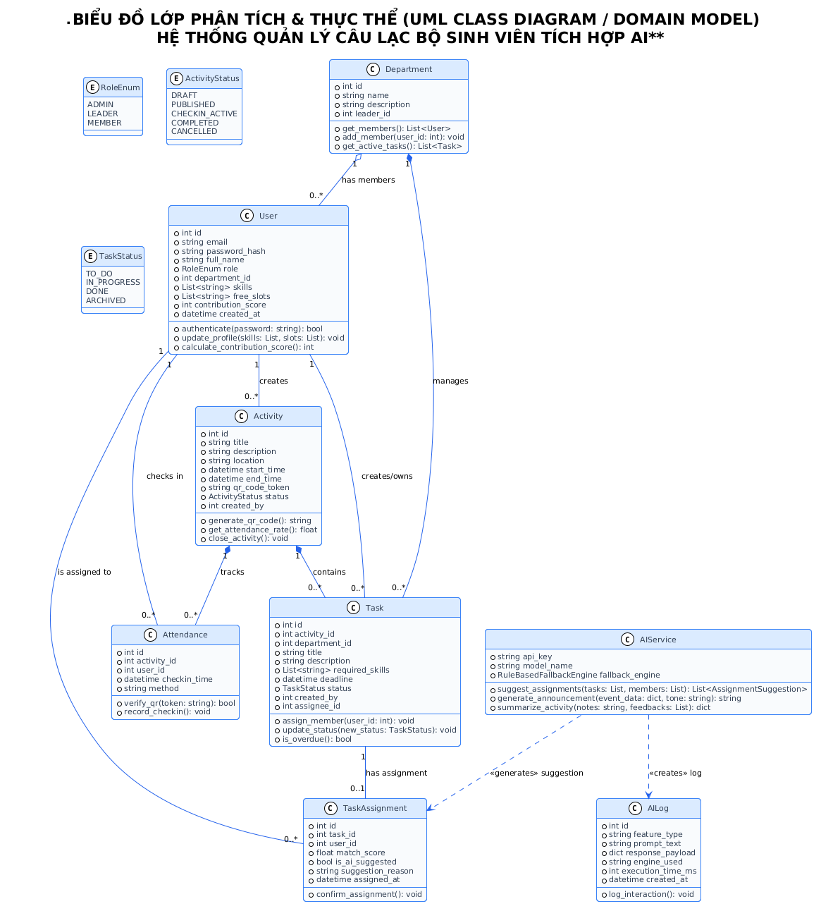

*Hình 5.1: Biểu đồ Lớp Phân tích & Thực thể CSDL (UML Class Diagram / Domain Entity Model)*

`plantuml
@startuml class_diagram
!theme plain
skinparam backgroundColor #FFFFFF
skinparam shadowing false
skinparam roundcorner 8
skinparam defaultFontName "Segoe UI"
skinparam defaultFontSize 11

skinparam class {
    BackgroundColor #F8FAFC
    BorderColor #3B82F6
    HeaderBackgroundColor #DBEAFE
    FontColor #0F172A
    AttributeFontColor #334155
    MethodFontColor #1E293B
    ArrowColor #2563EB
}

title **BIỂU ĐỒ LỚP PHÂN TÍCH & THỰC THỂ (UML CLASS DIAGRAM / DOMAIN MODEL)\nHỆ THỐNG QUẢN LÝ CÂU LẠC BỘ SINH VIÊN TÍCH HỢP AI**

enum RoleEnum {
    ADMIN
    LEADER
    MEMBER
}

enum ActivityStatus {
    DRAFT
    PUBLISHED
    CHECKIN_ACTIVE
    COMPLETED
    CANCELLED
}

enum TaskStatus {
    TO_DO
    IN_PROGRESS
    DONE
    ARCHIVED
}

class User {
    +int id
    +string email
    +string password_hash
    +string full_name
    +RoleEnum role
    +int department_id
    +List<string> skills
    +List<string> free_slots
    +int contribution_score
    +datetime created_at
    --
    +authenticate(password: string): bool
    +update_profile(skills: List, slots: List): void
    +calculate_contribution_score(): int
}

class Department {
    +int id
    +string name
    +string description
    +int leader_id
    --
    +get_members(): List<User>
    +add_member(user_id: int): void
    +get_active_tasks(): List<Task>
}

class Activity {
    +int id
    +string title
    +string description
    +string location
    +datetime start_time
    +datetime end_time
    +string qr_code_token
    +ActivityStatus status
    +int created_by
    --
    +generate_qr_code(): string
    +get_attendance_rate(): float
    +close_activity(): void
}

class Attendance {
    +int id
    +int activity_id
    +int user_id
    +datetime checkin_time
    +string method
    --
    +verify_qr(token: string): bool
    +record_checkin(): void
}

class Task {
    +int id
    +int activity_id
    +int department_id
    +string title
    +string description
    +List<string> required_skills
    +datetime deadline
    +TaskStatus status
    +int created_by
    +int assignee_id
    --
    +assign_member(user_id: int): void
    +update_status(new_status: TaskStatus): void
    +is_overdue(): bool
}

class TaskAssignment {
    +int id
    +int task_id
    +int user_id
    +float match_score
    +bool is_ai_suggested
    +string suggestion_reason
    +datetime assigned_at
    --
    +confirm_assignment(): void
}

class AILog {
    +int id
    +string feature_type
    +string prompt_text
    +dict response_payload
    +string engine_used
    +int execution_time_ms
    +datetime created_at
    --
    +log_interaction(): void
}

class AIService {
    +string api_key
    +string model_name
    +RuleBasedFallbackEngine fallback_engine
    --
    +suggest_assignments(tasks: List, members: List): List<AssignmentSuggestion>
    +generate_announcement(event_data: dict, tone: string): string
    +summarize_activity(notes: string, feedbacks: List): dict
}

' Relationships
Department "1" o-- "0..*" User : "has members"
Department "1" *-- "0..*" Task : "manages"
User "1" -- "0..*" Attendance : "checks in"
Activity "1" *-- "0..*" Attendance : "tracks"
Activity "1" *-- "0..*" Task : "contains"
Task "1" -- "0..1" TaskAssignment : "has assignment"
User "1" -- "0..*" TaskAssignment : "is assigned to"
User "1" -- "0..*" Activity : "creates"
User "1" -- "0..*" Task : "creates/owns"

AIService ..> AILog : "<<creates>> log"
AIService ..> TaskAssignment : "<<generates>> suggestion"

@enduml
```

---

### 5.2 Biểu đồ Hoạt động (UML Activity Diagrams)

#### 5.2.1 Activity Diagram 01: Quy trình Đăng nhập, Xác thực JWT & Phân quyền RBAC
``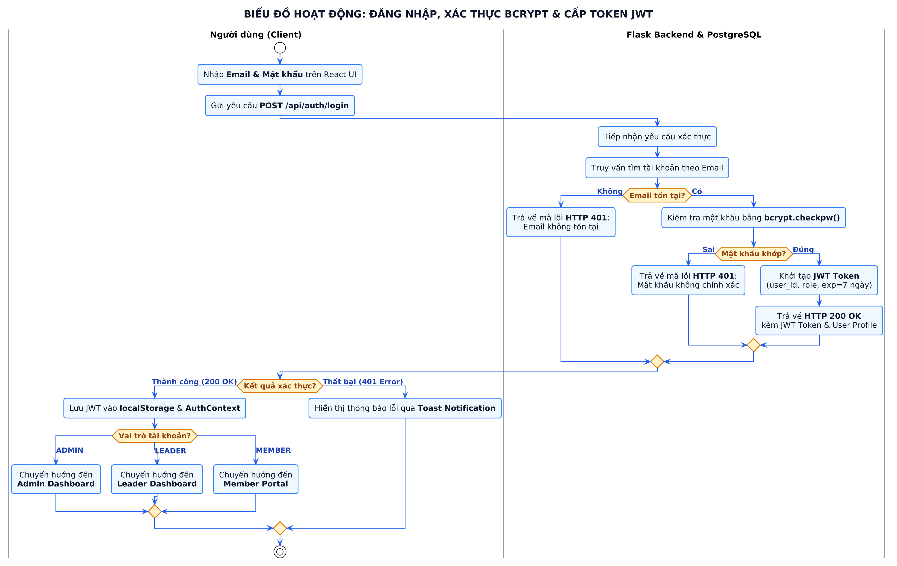

*Hình 5.2.1: Hoạt động Đăng nhập, Xác thực Bcrypt & Cấp Token JWT*

`plantuml
@startuml activity_auth_login
!theme plain
skinparam backgroundColor #FFFFFF
skinparam shadowing false
skinparam roundcorner 8
skinparam defaultFontName "Segoe UI"
skinparam defaultFontSize 14
skinparam defaultTextAlignment center
skinparam dpi 200

skinparam title {
    FontSize 18
    FontStyle bold
    FontColor #0F172A
}

skinparam arrow {
    Color #2563EB
    FontColor #1E40AF
    FontSize 13
    FontStyle bold
}

skinparam activity {
    BackgroundColor #EFF6FF
    BorderColor #3B82F6
    BorderThickness 1.5
    FontColor #0F172A
    FontSize 14
    DiamondBackgroundColor #FEF3C7
    DiamondBorderColor #D97706
    DiamondFontColor #92400E
    DiamondFontSize 13
    DiamondFontStyle bold
}

skinparam swimlane {
    TitleFontSize 15
    TitleFontStyle bold
    BorderColor #94A3B8
    BorderThickness 1.5
}

title BIỂU ĐỒ HOẠT ĐỘNG: ĐĂNG NHẬP, XÁC THỰC BCRYPT & CẤP TOKEN JWT

|Người dùng (Client)|
start
:Nhập **Email & Mật khẩu** trên React UI;
:Gửi yêu cầu **POST /api/auth/login**;

|Flask Backend & PostgreSQL|
:Tiếp nhận yêu cầu xác thực;
:Truy vấn tìm tài khoản theo Email;

if (Email tồn tại?) then (Không)
    :Trả về mã lỗi **HTTP 401**:\nEmail không tồn tại;
else (Có)
    :Kiểm tra mật khẩu bằng **bcrypt.checkpw()**;
    if (Mật khẩu khớp?) then (Sai)
        :Trả về mã lỗi **HTTP 401**:\nMật khẩu không chính xác;
    else (Đúng)
        :Khởi tạo **JWT Token**\n(user_id, role, exp=7 ngày);
        :Trả về **HTTP 200 OK**\nkèm JWT Token & User Profile;
    endif
endif

|Người dùng (Client)|
if (Kết quả xác thực?) then (Thành công (200 OK))
    :Lưu JWT vào **localStorage** & **AuthContext**;
    switch (Vai trò tài khoản?)
    case (ADMIN)
        :Chuyển hướng đến\n**Admin Dashboard**;
    case (LEADER)
        :Chuyển hướng đến\n**Leader Dashboard**;
    case (MEMBER)
        :Chuyển hướng đến\n**Member Portal**;
    endswitch
else (Thất bại (401 Error))
    :Hiển thị thông báo lỗi qua **Toast Notification**;
endif

stop
@enduml
```

#### 5.2.2 Activity Diagram 02: Quy trình Tổ chức Sự kiện & Điểm danh Tự động bằng Mã QR Độc bản
``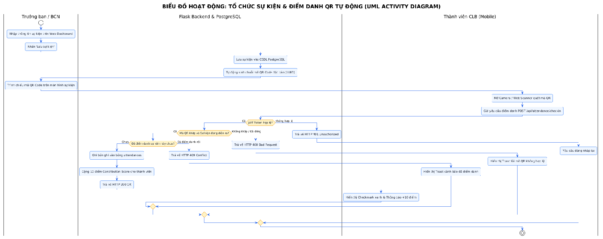

*Hình 5.2.2: Hoạt động Tổ chức Sự kiện & Quét QR Điểm danh qua Mobile*

`plantuml
@startuml activity_qr_attendance
!theme plain
skinparam backgroundColor #FFFFFF
skinparam shadowing false
skinparam roundcorner 8
skinparam defaultFontName "Segoe UI"

skinparam activity {
    BackgroundColor #EFF6FF
    BorderColor #3B82F6
    FontColor #0F172A
    DiamondBackgroundColor #FEF3C7
    DiamondBorderColor #F59E0B
    ArrowColor #2563EB
}

title **BIỂU ĐỒ HOẠT ĐỘNG: TỔ CHỨC SỰ KIỆN & ĐIỂM DANH QR TỰ ĐỘNG (UML ACTIVITY DIAGRAM)**

|Trưởng ban / BCN|
start
:Nhập thông tin sự kiện trên Web Dashboard;
:Nhấn 'Lưu Sự kiện';

|Flask Backend & PostgreSQL|
:Lưu sự kiện vào CSDL PostgreSQL;
:Tự động sinh chuỗi mã QR Code độc bản (UUID);

|Trưởng ban / BCN|
:Trình chiếu mã QR Code trên màn hình sự kiện;

|Thành viên CLB (Mobile)|
:Mở Camera / Web Scanner quét mã QR;
:Gửi yêu cầu điểm danh POST /api/attendance/checkin;

|Flask Backend & PostgreSQL|
if (JWT Token hợp lệ?) then (Có)
    if (Mã QR khớp và Sự kiện đang diễn ra?) then (Có)
        if (Đã điểm danh sự kiện này chưa?) then (Chưa)
            :Ghi bản ghi vào bảng attendances;
            :Cộng 10 điểm Contribution Score cho thành viên;
            :Trả về HTTP 200 OK;
            
            |Thành viên CLB (Mobile)|
            :Hiển thị Checkmark xanh & Thông báo +10 điểm;
        else (Đã điểm danh rồi)
            |Flask Backend & PostgreSQL|
            :Trả về HTTP 409 Conflict;
            
            |Thành viên CLB (Mobile)|
            :Hiển thị Toast cảnh báo đã điểm danh;
        endif
    else (Không khớp / Đã đóng)
        |Flask Backend & PostgreSQL|
        :Trả về HTTP 400 Bad Request;
        
        |Thành viên CLB (Mobile)|
        :Hiển thị Toast lỗi mã QR không hợp lệ;
    endif
else (Không hợp lệ)
    |Flask Backend & PostgreSQL|
    :Trả về HTTP 401 Unauthorized;
    
    |Thành viên CLB (Mobile)|
    :Yêu cầu đăng nhập lại;
endif

stop
@enduml
```

#### 5.2.3 Activity Diagram 03: Quy trình AI Smart Matchmaking với Dual-Engine Fallback
``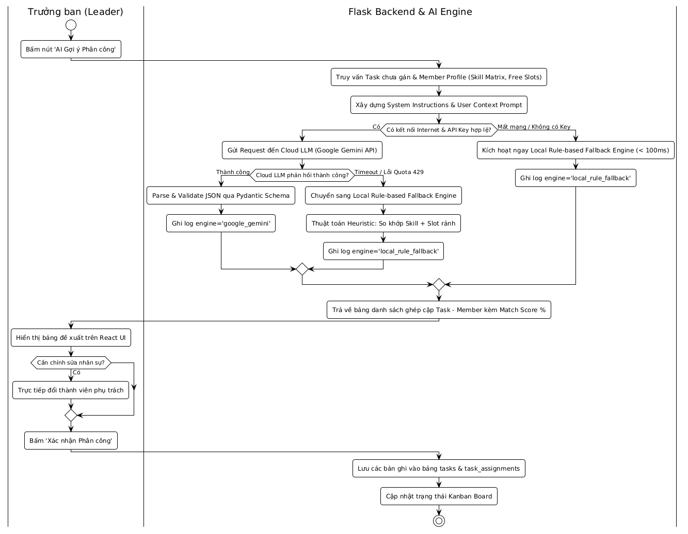

*Hình 5.2.3: Hoạt động AI Smart Matchmaking với cơ chế Dual-Engine Fallback (< 100ms switch)*

`plantuml
@startuml activity_ai_matching
!theme plain
skinparam backgroundColor #FFFFFF
skinparam shadowing false
skinparam roundcorner 8

|Trưởng ban (Leader)|
start
:Bấm nút 'AI Gợi ý Phân công';

|Flask Backend & AI Engine|
:Truy vấn Task chưa gán & Member Profile (Skill Matrix, Free Slots);
:Xây dựng System Instructions & User Context Prompt;

if (Có kết nối Internet & API Key hợp lệ?) then (Có)
    :Gửi Request đến Cloud LLM (Google Gemini API);
    if (Cloud LLM phản hồi thành công?) then (Thành công)
        :Parse & Validate JSON qua Pydantic Schema;
        :Ghi log engine='google_gemini';
    else (Timeout / Lỗi Quota 429)
        :Chuyển sang Local Rule-based Fallback Engine;
        :Thuật toán Heuristic: So khớp Skill + Slot rảnh;
        :Ghi log engine='local_rule_fallback';
    endif
else (Mất mạng / Không có Key)
    :Kích hoạt ngay Local Rule-based Fallback Engine (< 100ms);
    :Ghi log engine='local_rule_fallback';
endif

:Trả về bảng danh sách ghép cặp Task - Member kèm Match Score %;

|Trưởng ban (Leader)|
:Hiển thị bảng đề xuất trên React UI;
if (Cần chỉnh sửa nhân sự?) then (Có)
    :Trực tiếp đổi thành viên phụ trách;
endif
:Bấm 'Xác nhận Phân công';

|Flask Backend & AI Engine|
:Lưu các bản ghi vào bảng tasks & task_assignments;
:Cập nhật trạng thái Kanban Board;

stop
@enduml
```

---

### 5.3 Biểu đồ Tuần tự (UML Sequence Diagrams)

#### 5.3.1 Sequence Diagram 01: Xác thực Đăng nhập & Cấp JWT Token
``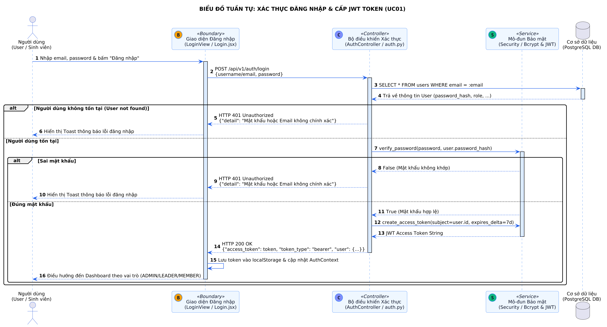

*Hình 5.3.1: Tuần tự Xác thực Đăng nhập & Điều hướng vai trò*

`plantuml
@startuml sequence_auth_login
!theme plain
skinparam backgroundColor #FFFFFF
skinparam shadowing false
skinparam roundcorner 8

autonumber
actor "Người dùng" as User
participant "React Frontend (Vite)" as UI
participant "Flask Auth Controller" as AuthCtrl
participant "Security (bcrypt/JWT)" as Sec
participant "PostgreSQL Database" as DB

User -> UI : Nhập email, password & bấm "Đăng nhập"
UI -> AuthCtrl : POST /api/auth/login {email, password}
AuthCtrl -> DB : SELECT * FROM users WHERE email = :email
DB --> AuthCtrl : Trả về User Entity (password_hash, role)

alt Người dùng không tồn tại
    AuthCtrl --> UI : HTTP 401 Unauthorized {"message": "Email không tồn tại"}
    UI --> User : Hiển thị thông báo lỗi
else Người dùng tồn tại
    AuthCtrl -> Sec : bcrypt.checkpw(password, password_hash)
    alt Sai mật khẩu
        Sec --> AuthCtrl : False
        AuthCtrl --> UI : HTTP 401 Unauthorized {"message": "Mật khẩu không đúng"}
        UI --> User : Hiển thị thông báo lỗi
    else Đúng mật khẩu
        Sec --> AuthCtrl : True
        AuthCtrl -> Sec : create_access_token(user_id, role, expires_in=7d)
        Sec --> AuthCtrl : JWT Token String
        AuthCtrl --> UI : HTTP 200 OK {token, user: {id, full_name, role}}
        UI -> UI : Lưu token vào localStorage & AuthContext
        UI --> User : Chuyển hướng đến Dashboard tương ứng vai trò
    end
end
@enduml
```

#### 5.3.2 Sequence Diagram 02: Quét Mã QR Điểm danh Sự kiện Realtime
``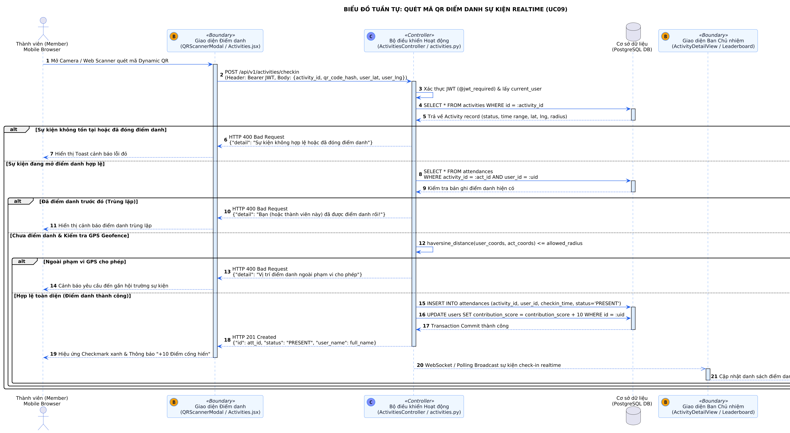

*Hình 5.3.2: Tuần tự Quét QR Điểm danh Realtime & Chống gian lận*

`plantuml
@startuml sequence_qr_checkin
!theme plain
skinparam backgroundColor #FFFFFF
skinparam shadowing false
skinparam roundcorner 8
skinparam defaultFontName "Segoe UI"

skinparam sequence {
    ArrowColor #2563EB
    ActorBorderColor #1D4ED8
    LifeLineBorderColor #3B82F6
    LifeLineBackgroundColor #DBEAFE
    ParticipantBorderColor #3B82F6
    ParticipantBackgroundColor #EFF6FF
    ParticipantFontColor #0F172A
}

title **BIỂU ĐỒ TUẦN TỰ: QUÉT MÃ QR ĐIỂM DANH SỰ KIỆN REALTIME (UC09)**

autonumber
actor "Thành viên (Member)\nMobile Browser" as Member
participant "React Frontend\n(Vite Check-in UI)" as UI
participant "Flask Attendance API\n(Controller)" as Controller
participant "PostgreSQL DB\n(Docker Container)" as DB
actor "Trưởng ban (Leader)\nWeb Dashboard" as Leader

Member -> UI : Mở Camera / Web Scanner quét mã QR
UI -> Controller : POST /api/attendance/checkin\n(Header: Bearer JWT, Body: {qr_token})

activate Controller
Controller -> Controller : Xác thực JWT (@jwt_required)

Controller -> DB : SELECT * FROM activities WHERE qr_code_token = :qr_token
activate DB
DB --> Controller : Trả về Activity record (status, time range)
deactivate DB

alt Mã QR không khớp hoặc sự kiện đã đóng
    Controller --> UI : HTTP 400 Bad Request\n{"message": "Mã QR không hợp lệ hoặc sự kiện đã đóng"}
    UI --> Member : Hiển thị Toast thông báo lỗi đỏ
else Sự kiện đang diễn ra hợp lệ
    Controller -> DB : SELECT * FROM attendances\nWHERE activity_id = :act_id AND user_id = :uid
    activate DB
    DB --> Controller : Kiểm tra bản ghi điểm danh
    deactivate DB
    
    alt Đã điểm danh trước đó
        Controller --> UI : HTTP 409 Conflict\n{"message": "Bạn đã điểm danh sự kiện này rồi"}
        UI --> Member : Hiển thị cảnh báo điểm danh trùng lặp
    else Chưa điểm danh
        Controller -> DB : INSERT INTO attendances\n(activity_id, user_id, checkin_time, method)
        activate DB
        Controller -> DB : UPDATE users SET contribution_score = contribution_score + 10\nWHERE id = :uid
        DB --> Controller : Commit Transaction thành công
        deactivate DB
        
        Controller --> UI : HTTP 200 OK\n{"message": "Điểm danh thành công", "points_earned": 10}
        UI --> Member : Hiệu ứng Checkmark xanh & Thông báo +10 điểm
        
        Controller -->> Leader : WebSocket / Polling Refresh Leaderboard
    end
end
deactivate Controller

@enduml
```

#### 5.3.3 Sequence Diagram 03: AI Gợi ý Phân công Nhiệm vụ với Dual-Engine Fallback
``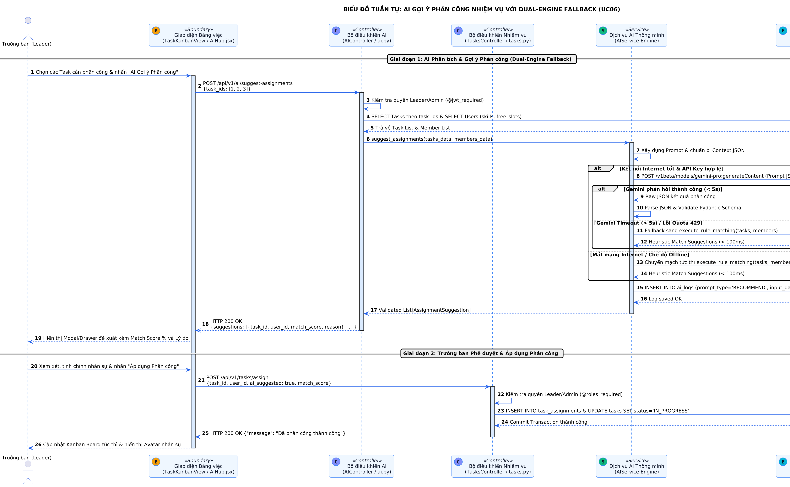

*Hình 5.3.3: Tuần tự AI Gợi ý Phân công với Dual Fallback (< 100ms switch)*

`plantuml
@startuml sequence_ai_matchmaking
!theme plain
skinparam backgroundColor #FFFFFF
skinparam shadowing false
skinparam roundcorner 8
skinparam defaultFontName "Segoe UI"

skinparam sequence {
    ArrowColor #2563EB
    ActorBorderColor #1D4ED8
    LifeLineBorderColor #3B82F6
    LifeLineBackgroundColor #DBEAFE
    ParticipantBorderColor #3B82F6
    ParticipantBackgroundColor #EFF6FF
    ParticipantFontColor #0F172A
}

title **BIỂU ĐỒ TUẦN TỰ: AI GỢI Ý PHÂN CÔNG NHIỆM VỤ VỚI DUAL-ENGINE FALLBACK (UC06)**

autonumber
actor "Trưởng ban (Leader)" as Leader
participant "React Task Kanban\n(Frontend)" as UI
participant "Flask Task Controller\n(Backend API)" as Controller
participant "AIService Engine\n(Service Layer)" as AIService
participant "Google Gemini API\n(Cloud LLM)" as Gemini
participant "Local Rule Engine\n(Fallback Matcher)" as Fallback
participant "PostgreSQL DB\n(Database)" as DB

Leader -> UI : Bấm nút "AI Gợi ý Phân công" (Activity ID)
UI -> Controller : POST /api/ai/suggest-assignments {activity_id}

activate Controller
Controller -> Controller : Kiểm tra quyền Leader/Admin (@roles_required)
Controller -> DB : Truy vấn Tasks chưa gán & Members (Skills, Free Slots)
activate DB
DB --> Controller : Trả về Task List & Member List
deactivate DB

Controller -> AIService : match_tasks_to_members(tasks, members)
activate AIService
AIService -> AIService : Chuẩn bị Prompt & Context JSON

alt Kết nối Internet tốt & API Key hợp lệ
    AIService -> Gemini : POST /v1beta/models/gemini-pro:generateContent (JSON Payload)
    activate Gemini
    alt Gemini phản hồi thành công (< 5s)
        Gemini --> AIService : Raw JSON String
        deactivate Gemini
        AIService -> AIService : Parse & Validate bằng Pydantic Schema
    else Gemini Timeout / Lỗi Quota 429
        AIService -> Fallback : execute_rule_matching(tasks, members)
        activate Fallback
        Fallback --> AIService : Heuristic Match Results (< 100ms)
        deactivate Fallback
    end
else Mất mạng Internet / Chế độ Offline
    AIService -> Fallback : execute_rule_matching(tasks, members)
    activate Fallback
    Fallback --> AIService : Heuristic Match Results (< 100ms)
    deactivate Fallback
end

AIService -> DB : INSERT INTO ai_logs (feature, prompt, response, engine, time_ms)
activate DB
DB --> AIService : Log saved
deactivate DB

AIService --> Controller : Validated List[AssignmentSuggestion]
deactivate AIService

Controller --> UI : HTTP 200 OK {suggestions: [{task_id, user_id, match_score, reason}, ...]}
deactivate Controller

UI --> Leader : Hiển thị Bảng ghép cặp đề xuất kèm Match Score %

Leader -> UI : Xem xét, tinh chỉnh nhân sự & bấm "Áp dụng Phân công"
UI -> Controller : POST /api/tasks/batch-assign {assignments}
activate Controller
Controller -> DB : UPDATE tasks & INSERT INTO task_assignments
activate DB
DB --> Controller : Commit OK
deactivate DB
Controller --> UI : HTTP 200 OK {"message": "Đã phân công thành công"}
deactivate Controller
UI --> Leader : Cập nhật Kanban Board tức thì

@enduml
```

#### 5.3.4 Sequence Diagram 04: Cập nhật Trạng thái Task trên Kanban Board với Kiểm soát RBAC
``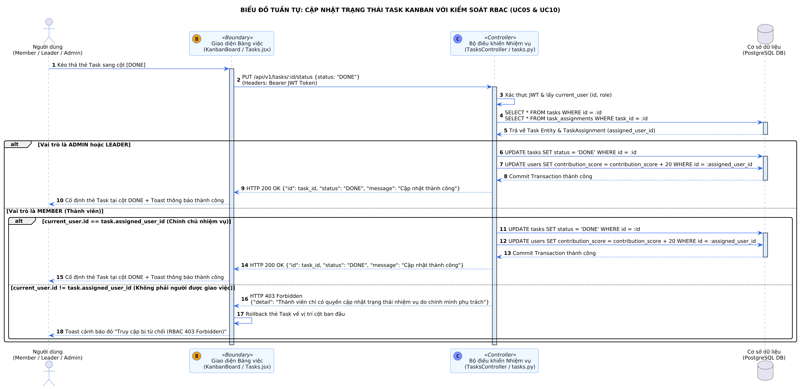

*Hình 5.3.4: Tuần tự Cập nhật Task Kanban với Kiểm soát RBAC (HTTP 401/403)*

`plantuml
@startuml sequence_kanban_rbac
!theme plain
skinparam backgroundColor #FFFFFF
skinparam shadowing false
skinparam roundcorner 8
skinparam defaultFontName "Segoe UI"

skinparam sequence {
    ArrowColor #2563EB
    ActorBorderColor #1D4ED8
    LifeLineBorderColor #3B82F6
    LifeLineBackgroundColor #DBEAFE
    ParticipantBorderColor #3B82F6
    ParticipantBackgroundColor #EFF6FF
    ParticipantFontColor #0F172A
}

title **BIỂU ĐỒ TUẦN TỰ: CẬP NHẬT TRẠNG THÁI TASK KANBAN VỚI KIỂM SOÁT RBAC (UC05 & UC10)**

autonumber
actor "Người dùng (Member / Leader)" as User
participant "React Kanban UI\n(Vite Component)" as UI
participant "Flask Task Controller\n(Backend REST API)" as Controller
participant "PostgreSQL DB\n(Docker Database)" as DB

User -> UI : Kéo thả thẻ Task sang cột [DONE]
UI -> Controller : PATCH /api/tasks/:id/status {status: "DONE"}\n(Headers: Bearer JWT Token)

activate Controller
Controller -> Controller : Xác thực JWT & lấy current_user (id, role)

Controller -> DB : SELECT * FROM tasks WHERE id = :id
activate DB
DB --> Controller : Trả về Task Entity (created_by, assignee_id, status)
deactivate DB

alt Vai trò là ADMIN hoặc LEADER
    Controller -> DB : UPDATE tasks SET status = 'DONE', updated_at = NOW() WHERE id = :id
    activate DB
    Controller -> DB : UPDATE users SET contribution_score = contribution_score + 20 WHERE id = :assignee_id
    DB --> Controller : Commit OK
    deactivate DB
    
    Controller --> UI : HTTP 200 OK {"message": "Cập nhật thành công"}
    UI --> User : Cố định thẻ Task tại cột DONE + Toast thông báo xanh
else Vai trò là MEMBER
    alt current_user.id == task.assignee_id (Chính chủ nhiệm vụ)
        Controller -> DB : UPDATE tasks SET status = 'DONE', updated_at = NOW() WHERE id = :id
        activate DB
        Controller -> DB : UPDATE users SET contribution_score = contribution_score + 20 WHERE id = :assignee_id
        DB --> Controller : Commit OK
        deactivate DB
        
        Controller --> UI : HTTP 200 OK {"message": "Cập nhật thành công"}
        UI --> User : Cố định thẻ Task tại cột DONE + Toast thông báo xanh
    else current_user.id != task.assignee_id (Không phải người được giao việc)
        Controller --> UI : HTTP 403 Forbidden\n{"message": "Bạn không có quyền sửa nhiệm vụ của thành viên khác"}
        UI -> UI : Rollback thẻ Task về vị trí cột ban đầu
        UI --> User : Toast cảnh báo đỏ "RBAC Access Denied"
    end
end
deactivate Controller

@enduml
```

---

### 5.4 Biểu đồ Máy Trạng thái (UML State Machine Diagrams)

#### 5.4.1 State Machine Diagram 01: Vòng đời Trạng thái Nhiệm vụ (Task Lifecycle)
``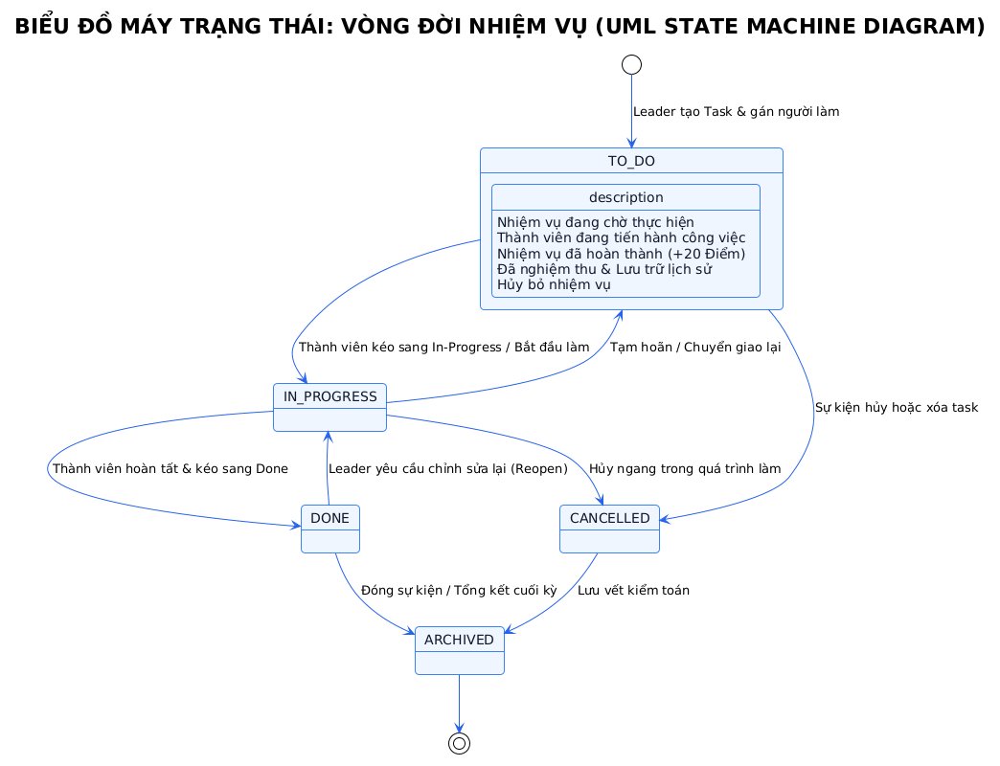

*Hình 5.4.1: Vòng đời Trạng thái Nhiệm vụ (TO_DO -> IN_PROGRESS -> REVIEW -> DONE...)*

`plantuml
@startuml state_task_lifecycle
!theme plain
skinparam backgroundColor #FFFFFF
skinparam shadowing false
skinparam roundcorner 8
skinparam defaultFontName "Segoe UI"

skinparam state {
    BackgroundColor #EFF6FF
    BorderColor #3B82F6
    FontColor #0F172A
    ArrowColor #2563EB
}

title **BIỂU ĐỒ MÁY TRẠNG THÁI: VÒNG ĐỜI NHIỆM VỤ (UML STATE MACHINE DIAGRAM)**

[*] --> TO_DO : Leader tạo Task & gán người làm

state TO_DO {
    description: Nhiệm vụ đang chờ thực hiện
}

state IN_PROGRESS {
    description: Thành viên đang tiến hành công việc
}

state DONE {
    description: Nhiệm vụ đã hoàn thành (+20 Điểm)
}

state ARCHIVED {
    description: Đã nghiệm thu & Lưu trữ lịch sử
}

state CANCELLED {
    description: Hủy bỏ nhiệm vụ
}

TO_DO --> IN_PROGRESS : Thành viên kéo sang In-Progress / Bắt đầu làm
IN_PROGRESS --> TO_DO : Tạm hoãn / Chuyển giao lại

IN_PROGRESS --> DONE : Thành viên hoàn tất & kéo sang Done
DONE --> IN_PROGRESS : Leader yêu cầu chỉnh sửa lại (Reopen)

TO_DO --> CANCELLED : Sự kiện hủy hoặc xóa task
IN_PROGRESS --> CANCELLED : Hủy ngang trong quá trình làm

DONE --> ARCHIVED : Đóng sự kiện / Tổng kết cuối kỳ
CANCELLED --> ARCHIVED : Lưu vết kiểm toán

ARCHIVED --> [*]

@enduml
```

#### 5.4.2 State Machine Diagram 02: Vòng đời Trạng thái Sự kiện (Activity Lifecycle)
``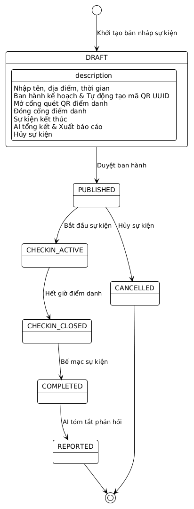

*Hình 5.4.2: Vòng đời Trạng thái Sự kiện (DRAFT -> PUBLISHED -> CHECKIN_ACTIVE -> COMPLETED...)*

`plantuml
@startuml state_activity_lifecycle
!theme plain
skinparam backgroundColor #FFFFFF
skinparam shadowing false
skinparam roundcorner 8

[*] --> DRAFT : Khởi tạo bản nháp sự kiện

state DRAFT {
    description: Nhập tên, địa điểm, thời gian
}

state PUBLISHED {
    description: Ban hành kế hoạch & Tự động tạo mã QR UUID
}

state CHECKIN_ACTIVE {
    description: Mở cổng quét QR điểm danh
}

state CHECKIN_CLOSED {
    description: Đóng cổng điểm danh
}

state COMPLETED {
    description: Sự kiện kết thúc
}

state REPORTED {
    description: AI tổng kết & Xuất báo cáo
}

state CANCELLED {
    description: Hủy sự kiện
}

DRAFT --> PUBLISHED : Duyệt ban hành
PUBLISHED --> CHECKIN_ACTIVE : Bắt đầu sự kiện
CHECKIN_ACTIVE --> CHECKIN_CLOSED : Hết giờ điểm danh
CHECKIN_CLOSED --> COMPLETED : Bế mạc sự kiện
COMPLETED --> REPORTED : AI tóm tắt phản hồi
PUBLISHED --> CANCELLED : Hủy sự kiện
REPORTED --> [*]
CANCELLED --> [*]
@enduml
```

---

### 5.5 Biểu đồ Thành phần & Triển khai (UML Component & Deployment Diagram)
``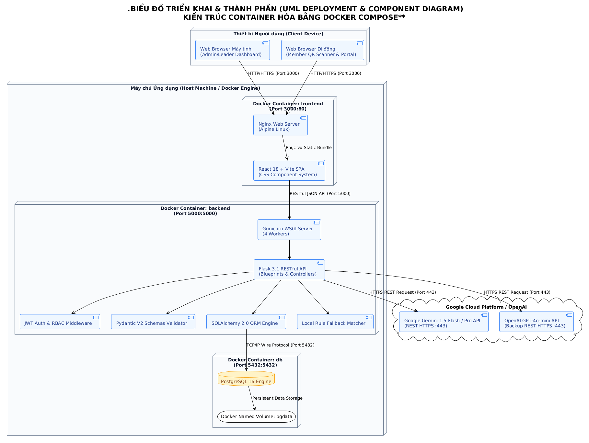

*Hình 5.5: Triển khai Kiến trúc Container 3-tier Docker Compose + Cloud AI*

`plantuml
@startuml deployment_docker
!theme plain
skinparam backgroundColor #FFFFFF
skinparam shadowing false
skinparam roundcorner 8
skinparam defaultFontName "Segoe UI"

skinparam node {
    BackgroundColor #F8FAFC
    BorderColor #64748B
    FontColor #0F172A
}

skinparam component {
    BackgroundColor #EFF6FF
    BorderColor #3B82F6
    FontColor #1E3A8A
}

skinparam database {
    BackgroundColor #FEF3C7
    BorderColor #F59E0B
    FontColor #78350F
}

title **BIỂU ĐỒ TRIỂN KHAI & THÀNH PHẦN (UML DEPLOYMENT & COMPONENT DIAGRAM)\nKIẾN TRÚC CONTAINER HÓA BẰNG DOCKER COMPOSE**

node "Thiết bị Người dùng (Client Device)" {
    component "Web Browser Máy tính\n(Admin/Leader Dashboard)" as DesktopBrowser
    component "Web Browser Di động\n(Member QR Scanner & Portal)" as MobileBrowser
}

node "Máy chủ Ứng dụng (Host Machine / Docker Engine)" {

    node "Docker Container: frontend\n(Port 3000:80)" as C_Frontend {
        component "Nginx Web Server\n(Alpine Linux)" as Nginx
        component "React 18 + Vite SPA\n(CSS Component System)" as ReactApp
        Nginx --> ReactApp : Phục vụ Static Bundle
    }

    node "Docker Container: backend\n(Port 5000:5000)" as C_Backend {
        component "Gunicorn WSGI Server\n(4 Workers)" as Gunicorn
        component "Flask 3.1 RESTful API\n(Blueprints & Controllers)" as FlaskApp
        component "JWT Auth & RBAC Middleware" as AuthMid
        component "Pydantic V2 Schemas Validator" as Pydantic
        component "SQLAlchemy 2.0 ORM Engine" as SQLAlchemy
        component "Local Rule Fallback Matcher" as Fallback
        
        Gunicorn --> FlaskApp
        FlaskApp --> AuthMid
        FlaskApp --> Pydantic
        FlaskApp --> SQLAlchemy
        FlaskApp --> Fallback
    }

    node "Docker Container: db\n(Port 5432:5432)" as C_DB {
        database "PostgreSQL 16 Engine" as Postgres
        storage "Docker Named Volume: pgdata" as DBVolume
        Postgres --> DBVolume : Persistent Data Storage
    }
}

cloud "Google Cloud Platform / OpenAI" {
    component "Google Gemini 1.5 Flash / Pro API\n(REST HTTPS :443)" as GeminiAPI
    component "OpenAI GPT-4o-mini API\n(Backup REST HTTPS :443)" as OpenAIAPI
}

DesktopBrowser --> Nginx : HTTP/HTTPS (Port 3000)
MobileBrowser --> Nginx : HTTP/HTTPS (Port 3000)

ReactApp --> Gunicorn : RESTful JSON API (Port 5000)
SQLAlchemy --> Postgres : TCP/IP Wire Protocol (Port 5432)

FlaskApp --> GeminiAPI : HTTPS REST Request (Port 443)
FlaskApp --> OpenAIAPI : HTTPS REST Request (Port 443)

@enduml
```

---

## CHƯƠNG 6: MA TRẬN TRUY VẾT YÊU CẦU (RTM) & KẾ HOẠCH BÀN GIAO GIAI ĐOẠN KT2 (TUẦN 3)

| Mã Yêu cầu | Nguồn gốc Khảo sát | Tác nhân Áp dụng | Use Case Ánh xạ | Lớp UML / Bảng PostgreSQL | Kế hoạch Triển khai Code Flask & React (KT2) |
| :---: | :--- | :--- | :---: | :--- | :--- |
| **FR-SYS-01** | Pain Point #3 (Bảo mật & Phân quyền) | All Actors | `UC01`, `UC12` | Class `User` $
ightarrow$ Table `users` | Tuần 4: Lập trình Flask Auth Blueprint, JWT & Security Middleware |
| **FR-SYS-02** | Pain Point #1 (Thiếu Skill & Free Slots) | Member, Admin | `UC02`, `UC12` | Class `User` $
ightarrow$ Table `users` (`skills, free_slots`) | Tuần 5: Lập trình Flask Members Blueprint & Pydantic Schema Validation |
| **FR-SYS-03** | Nhu cầu cơ cấu tổ chức & quản lý nhân sự | Admin | `UC11`, `UC12` | Class `Department` $
ightarrow$ Table `departments` | Tuần 5: Lập trình CRUD Ban chuyên môn & Phân bổ thành viên |
| **FR-SYS-04** | Pain Point #2 (Điểm danh giấy chậm, gian lận) | Leader, Member | `UC04`, `UC09` | Class `Activity`, `Attendance` $
ightarrow$ Table `activities`, `attendances` | Tuần 5: Lập trình Dynamic QR Generation & API Quét QR Check-in |
| **FR-SYS-05** | Pain Point #3 (Theo dõi task rời rạc, trễ hạn) | Leader, Member | `UC05`, `UC10` | Class `Task`, `TaskAssignment` $
ightarrow$ Table `tasks`, `task_assignments` | Tuần 6: Lập trình Kanban Board & Kiểm soát RBAC Update Task |
| **FR-SYS-06** | Pain Point #6 (Đánh giá đóng góp cảm tính) | All Actors | `UC03` | Class `Attendance`, `Task` $
ightarrow$ Tables `attendances`, `tasks` | Tuần 6: Lập trình Dashboard Stats & Leaderboard Realtime |
| **FR-AI-01** | Pain Point #4 (Viết bài truyền thông tốn thời gian) | Leader, Admin | `UC07` | Class `AIService`, `AILog` $
ightarrow$ Table `ai_logs` | Tuần 7: Tích hợp Prompt AI Sinh bài đăng đa Tone giọng |
| **FR-AI-02** | Pain Point #5 (Tóm tắt họp & phản hồi rời rạc) | Leader, Admin | `UC08` | Class `AIService`, `AILog` $
ightarrow$ Table `ai_logs` | Tuần 7: Tích hợp Prompt AI Tóm tắt biên bản 3 phần |
| **FR-AI-03** | Pain Point #1 (Phân công thủ công sai kỹ năng) | Leader, Admin | `UC06` | Class `AIService`, `TaskAssignment`, `AILog` | Tuần 7: Tích hợp Thuật toán AI Matchmaking & Dual-Engine Fallback |

---

## KẾT LUẬN GIAI ĐOẠN KT1 (HẾT TUẦN 3)

1. **Về mặt Khảo sát & Phân tích (Tuần 1 & 2):** Nhóm đã hoàn thành xuất sắc công tác khảo sát thực trạng, xác định chính xác 06 Điểm đau và chuẩn hóa thành **06 Yêu cầu Chức năng Quản lý (FR-SYS)**, **03 Yêu cầu Chức năng AI (FR-AI)** và **14 Tiêu chí Phi chức năng (NFR)** theo chuẩn ISO/IEC 25010 với đầy đủ tiêu chí nghiệm thu và phương pháp kiểm thử.
2. **Về mặt Thiết kế & Mô hình hóa UML (Tuần 3):** Đã hoàn tất trọn bộ mô hình hóa Ca sử dụng (Biểu đồ Use Case Tổng thể, 5 Biểu đồ Use Case Phân hệ, 12 Use Cases & 03 Use Case Specifications chi tiết) và hệ thống Biểu đồ UML toàn diện (Class Diagram, 3 Activity Diagrams, 4 Sequence Diagrams, 2 State Machine Diagrams, Component & Deployment Diagram) chèn trực tiếp đầy đủ mã nguồn **Mermaid** & **PlantUML**.
3. **Sẵn sàng chuyển giao sang Giai đoạn KT2:** Toàn bộ tài liệu khảo sát và phân tích yêu cầu này đóng vai trò là "Kim chỉ nam" kỹ thuật vững chắc để đội ngũ phát triển nhóm 15 bắt đầu bước vào giai đoạn lập trình mã nguồn Backend Flask, Frontend React-Vite, PostgreSQL Database và cấu hình Docker Compose từ **Tuần 4**.
